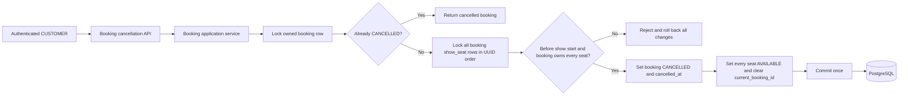
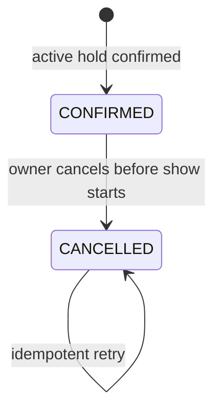
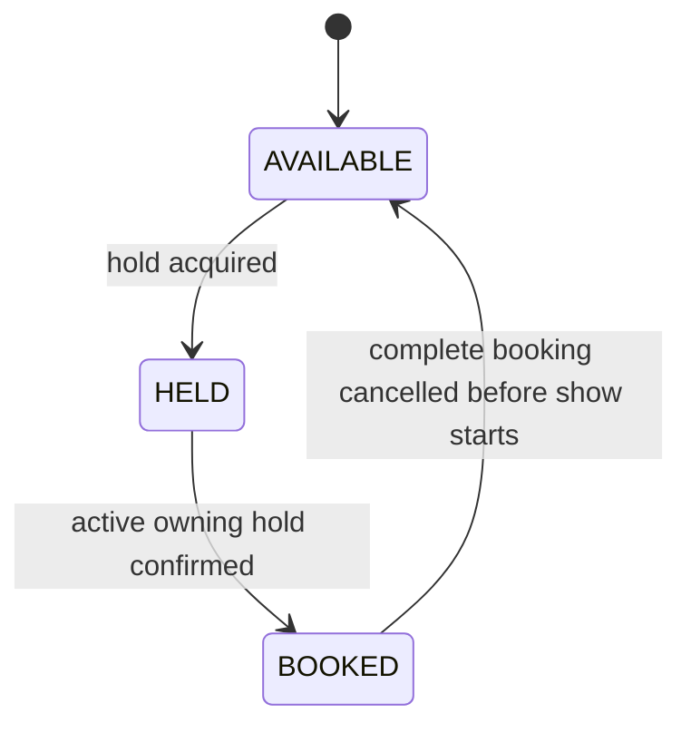
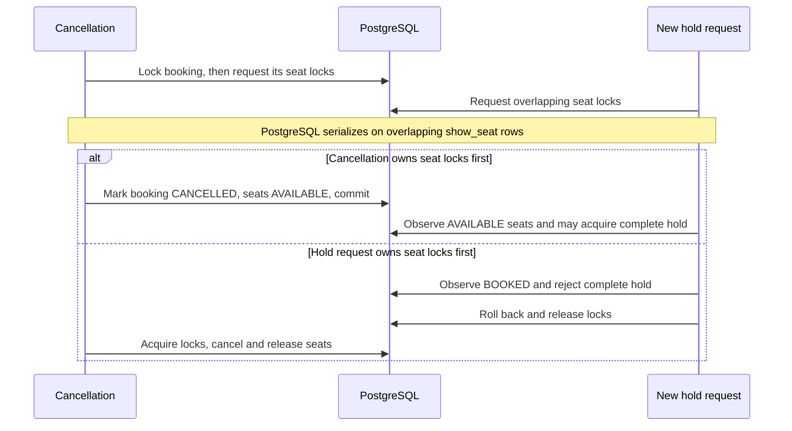

# Booking Cancellation Design

Status: **Implemented**

This document describes the implemented whole-booking cancellation flow. It extends the existing booking and show-seat state models without deleting booking history or introducing payment and refund behavior.

## 1. Confirmed Requirements

- An authenticated `CUSTOMER` can cancel only their own booking.
- Cancellation is allowed only before the booked show starts.
- Cancellation always covers the complete booking. Partial seat cancellation is not supported.
- The booking state change and release of every booked show seat must be atomic.
- Concurrent duplicate cancellations and cancellation races with new seat holds must be safe.
- PostgreSQL transactions and row locks are the concurrency authority; no JVM-local lock is used.
- Payment and refund processing are not part of cancellation.
- The flow is implemented through the API, Java application, Flyway migration, automated tests, and Postman collection.

## 2. Scope

### 2.1 In scope

- Cancel one `CONFIRMED` booking owned by the authenticated customer.
- Preserve the booking, booking items, prices, and confirmation data as history.
- Change the booking status to `CANCELLED` and record a UTC cancellation timestamp.
- Release every show seat currently owned by the booking in one transaction.
- Make duplicate cancellation requests idempotent.
- Return cancelled bookings through the existing owner-scoped detail and history APIs.
- Define schema changes, state transitions, API contracts, locking, failure behavior, and tests.

### 2.2 Out of scope

- Partial cancellation or selection of individual seats to cancel.
- Cancellation after or exactly at the show start instant.
- Cancellation fees, policy windows, or configurable cut-off periods before show time.
- Payments, refunds, credits, wallets, or financial reconciliation.
- Notifications.
- Theatre-admin or support-agent cancellation.
- Reinstating or reconfirming a cancelled booking.
- Deleting bookings or booking items.
- Cancellation reasons or a general booking-status event log.

## 3. High-Level Design



Cancellation remains inside the existing monolith's `booking` application boundary. It uses the existing booking, booking-item, show, and show-seat records. A new table, worker, event bus, or refund component is not needed for this phase.

## 4. State Model

### 4.1 Booking state



Rules:

- Only `CONFIRMED -> CANCELLED` is a state-changing cancellation.
- `CANCELLED` is terminal in this phase.
- A second cancellation of the same owner-scoped booking returns the existing cancelled representation and performs no writes.
- An existing `CANCELLED` booking is returned even if the retry arrives after show start. The original successful transition is not re-evaluated using a later time.
- The confirmation endpoint must continue to return the booking identified by the hold's unique `source_hold_id`. If that booking was later cancelled, it returns that `CANCELLED` booking and never creates or resurrects another booking from the same hold.

### 4.2 Show-seat state



For every item in the cancelled booking:

```text
BOOKED / current_booking_id = B / current_hold_id = NULL
    ->
AVAILABLE / current_booking_id = NULL / current_hold_id = NULL
```

All of those transitions happen in one transaction. No seat can be released independently of the other seats in the booking.

### 4.3 Source hold state

The source hold remains derived as `CONVERTED` after cancellation because it did produce a booking. Cancellation does not reactivate the hold and does not permit that hold to create another booking. This preserves the one-booking-per-hold invariant and keeps confirmation retry behavior deterministic.

## 5. Data Model Changes

### 5.1 Updated relationship view

```mermaid
erDiagram
    USER_ACCOUNT ||--o{ BOOKING : owns
    MOVIE_SHOW ||--o{ BOOKING : receives
    SEAT_HOLD ||--o| BOOKING : converts_to
    BOOKING ||--|{ BOOKING_ITEM : preserves
    SHOW_SEAT ||--o{ BOOKING_ITEM : historical_item
    BOOKING o|--o{ SHOW_SEAT : currently_owns

    BOOKING {
        uuid id PK
        uuid source_hold_id UK, FK
        uuid show_id FK
        uuid customer_account_id FK
        varchar status
        numeric total_amount
        varchar currency
        timestamptz confirmed_at
        timestamptz cancelled_at nullable
    }
    BOOKING_ITEM {
        uuid booking_id PK, FK
        uuid show_seat_id PK, FK
        numeric unit_price
    }
    SHOW_SEAT {
        uuid id PK
        varchar availability_status
        uuid current_hold_id FK
        uuid current_booking_id FK
    }
```

### 5.2 `booking` changes

Implemented migration changes:

- Extend the allowed `booking.status` values from only `CONFIRMED` to `CONFIRMED` and `CANCELLED`.
- Add nullable `cancelled_at TIMESTAMPTZ`.
- Store `cancelled_at` as a UTC instant captured from the injected UTC `Clock`.
- Add status/timestamp consistency checks equivalent to:

```sql
CHECK (
    (status = 'CONFIRMED' AND cancelled_at IS NULL)
    OR
    (status = 'CANCELLED' AND cancelled_at IS NOT NULL)
)
```

- Add `CHECK (cancelled_at IS NULL OR cancelled_at >= confirmed_at)`.

`confirmed_at`, `total_amount`, and `currency` remain unchanged after cancellation. No refund amount, refund status, cancellation fee, or cancellation reason is added.

### 5.3 `booking_item` retention

Every `booking_item` remains after cancellation. The item continues to record the exact show seat and final unit price that were confirmed. This is historical booking data, not a representation of current seat ownership.

The existing composite foreign key remains:

```text
show_seat(current_booking_id, id)
    -> booking_item(booking_id, show_seat_id)
```

Clearing `current_booking_id` is valid because the foreign-key column is nullable. The referenced booking items are not deleted.

### 5.4 `show_seat` constraints

The existing state/pointer constraint already supports the required released state:

```text
availability_status = AVAILABLE
AND current_hold_id IS NULL
AND current_booking_id IS NULL
```

No show-seat schema change is required. Cancellation changes the stored seat state from `BOOKED` to `AVAILABLE` and clears only the current booking pointer.

### 5.5 Indexes

No new index is recommended for this phase:

- Cancellation finds the booking by its primary key while including `customer_account_id` in the owner-scoped lock query.
- Booking items are found through the existing `(booking_id, show_seat_id)` primary key.
- Show seats are locked by their primary keys.
- The existing `(customer_account_id, confirmed_at DESC, id DESC)` booking-history index supports history for both statuses.

A status-only or show-level booking index would not serve any API in this design.

## 6. API Contracts

The following contract is implemented and included in the executable Postman collection.

### 6.1 Cancel an owned booking

`POST /api/v1/bookings/{bookingId}/cancellation`

Access: authenticated `CUSTOMER` owner only.

No request body is accepted. In particular, the client cannot submit customer ID, seat IDs, cancellation time, status, price, or refund information. The absence of seat IDs makes whole-booking cancellation explicit and prevents partial cancellation through this endpoint.

Success response: `200 OK`

```json
{
  "id": "6e20cc2c-740d-4fd0-85c8-c634c14db44d",
  "holdId": "973033f0-57bd-4ec3-bf42-d9a24bea39bb",
  "showId": "6e6e5731-8c4b-4bcb-a0cf-f36a45233b6c",
  "status": "CANCELLED",
  "confirmedAt": "2026-09-25T12:03:00Z",
  "cancelledAt": "2026-09-25T12:20:00Z",
  "totalPrice": {
    "amount": 500.00,
    "currency": "INR"
  },
  "seats": [
    {
      "showSeatId": "c4d7c07e-56eb-4abf-8aba-3b4a7b631375",
      "rowLabel": "A",
      "seatNumber": 1,
      "seatLabel": "A1",
      "tier": "REGULAR",
      "price": {
        "amount": 250.00,
        "currency": "INR"
      }
    },
    {
      "showSeatId": "d9c35647-f47f-43a5-8321-d4cc55459134",
      "rowLabel": "A",
      "seatNumber": 2,
      "seatLabel": "A2",
      "tier": "REGULAR",
      "price": {
        "amount": 250.00,
        "currency": "INR"
      }
    }
  ]
}
```

A duplicate request for the same already-cancelled booking returns the same state with `200 OK`. Idempotent success is preferred over `409 Conflict` because it safely handles a committed cancellation whose HTTP response was lost.

`POST` is preferred over `DELETE` because the booking resource is retained as history and changes state rather than being deleted.

### 6.2 Existing booking detail

`GET /api/v1/bookings/{bookingId}` remains owner-scoped and returns either `CONFIRMED` or `CANCELLED`.

The response adds nullable `cancelledAt`:

- `null` for `CONFIRMED` bookings;
- the stored UTC cancellation instant for `CANCELLED` bookings.

All booking items and original prices remain visible after cancellation.

### 6.3 Existing booking history

`GET /api/v1/bookings?page=0&size=20` continues to return only the authenticated customer's bookings and includes both `CONFIRMED` and `CANCELLED` records. Each summary adds nullable `cancelledAt` and retains the original `confirmedAt`, total price, and seat count.

Ordering remains `confirmedAt DESC, id DESC`. Cancellation does not reorder historical bookings and no status filter is introduced in this phase.

### 6.4 Related existing responses

- `GET /api/v1/holds/{holdId}` continues to report `CONVERTED` after the resulting booking is cancelled.
- `GET /api/v1/shows/{showId}/seats` reports the released seats as `AVAILABLE` after commit.
- Show detail and show search include the released seats in their available-seat aggregates after commit.
- Public APIs continue to expose `showSeatId`, never `physicalSeatId`, booking ownership, or cancellation ownership.

## 7. Cancellation Transaction

The booking row serializes cancellation requests for the same booking. The complete ordered show-seat set is the boundary that serializes seat release against new hold acquisition.

1. Authenticate a `CUSTOMER`; obtain `customerAccountId` only from the verified JWT.
2. Select `booking` by `bookingId` and `customerAccountId` with `FOR UPDATE`. A missing or foreign-owned booking returns `BOOKING_NOT_FOUND`.
3. If the locked booking status is `CANCELLED`, load its retained items and return it as an idempotent `200 OK`. Do not re-check show time and do not update rows.
4. Require the locked booking status to be `CONFIRMED`.
5. Read all immutable `booking_item.show_seat_id` values for the booking. Require at least one item.
6. Lock every corresponding `show_seat` row in ascending UUID order using one `FOR UPDATE OF show_seat` query.
7. Require the number of locked seats to equal the number of booking items.
8. After all required locks are acquired, capture `cancelledAt = clock.instant()` exactly once.
9. Load the immutable show start instant and require `cancelledAt < show.startsAt`. Equality means cancellation is closed.
10. Require every locked seat to:
    - belong to the booking's show;
    - have stored status `BOOKED`;
    - have `current_booking_id = booking.id`; and
    - have `current_hold_id = NULL`.
11. Change the booking to `CANCELLED` and set `cancelled_at = cancelledAt`.
12. Change every locked show seat to `AVAILABLE` and clear `current_booking_id`. Do not create, update, or delete booking items.
13. Flush and commit once. Return the cancelled booking only after successful commit.

Any validation failure or database error rolls back the booking change and every show-seat change. There is no partial release.

### 7.1 Required lock order

Every cancellation path must use:

```text
booking row -> show_seat rows ordered by UUID
```

Hold acquisition locks show-seat rows only. It does not lock booking rows, so it does not introduce a reverse `show_seat -> booking` lock order. Any future operation that needs both resources must follow the same order or revisit the deadlock analysis.

### 7.2 Time boundary

The cancellation timestamp is captured after all required seat locks are held. Time spent waiting for a concurrent transaction therefore counts against the cancellation window.

```text
cancelledAt < startsAt   => cancellation may succeed
cancelledAt >= startsAt  => SHOW_ALREADY_STARTED
```

The current create-only show model treats `startsAt` as immutable. If rescheduling is introduced later, its locking relationship with cancellation must be designed explicitly.

## 8. Concurrency Analysis

### 8.1 Two cancellation requests for the same booking

```mermaid
sequenceDiagram
    participant A as Cancellation A
    participant DB as PostgreSQL
    participant B as Cancellation B

    A->>DB: Lock owned booking B1
    DB-->>A: Lock granted
    B->>DB: Lock owned booking B1
    Note over B,DB: Waits
    A->>DB: Lock B1 seats, validate, cancel and release all
    A->>DB: Commit
    DB-->>B: Booking lock granted
    B->>DB: Observe CANCELLED
    DB-->>B: Return same booking; no writes
```

Exactly one request performs the transition. Both can return successful `200 OK` representations.

### 8.2 Cancellation races with a new hold



Both outcomes are valid serial outcomes. A hold never acquires a seat while it is still owned by the confirmed booking, and the hold operation remains all-or-nothing.

### 8.3 Cancellation races with show start

The post-lock `cancelledAt` is the linearization timestamp for the time rule. If it is before `startsAt`, cancellation is permitted even if the transaction commits just after the wall-clock start. If lock waiting pushes the captured instant to or beyond `startsAt`, the complete cancellation is rejected.

### 8.4 Failure and retry

- Failure before commit leaves the booking `CONFIRMED` and every seat `BOOKED`.
- Failure after commit but before the HTTP response may be indistinguishable to the client from rollback.
- Retrying obtains the booking lock, observes `CANCELLED`, and returns the stored result without releasing seats again.
- The retained booking items make the repeated response stable even if released seats are later held or booked by someone else.

## 9. Error Contract

Cancellation uses the existing `application/problem+json` envelope.

| HTTP status | Code | When |
|---:|---|---|
| 401 | `INVALID_TOKEN` / `TOKEN_EXPIRED` | No valid customer authentication is present. |
| 403 | `FORBIDDEN` | The authenticated role is not `CUSTOMER`. |
| 404 | `BOOKING_NOT_FOUND` | The booking does not exist or is not owned by the customer. |
| 409 | `SHOW_ALREADY_STARTED` | The post-lock cancellation timestamp is at or after show start. |
| 409 | `BOOKING_NO_LONGER_OWNS_SEATS` | One or more retained booking-item seats are missing or are not currently `BOOKED` by this booking. |

An already-cancelled booking is an idempotent success, not an error. Cross-customer access deliberately uses the same not-found response as a missing booking.

`BOOKING_NO_LONGER_OWNS_SEATS` is an invariant-protection error rather than an expected business path. If it occurs, no seat or booking change commits.

## 10. Security and Data Exposure

- The cancellation endpoint requires role `CUSTOMER`.
- Ownership is part of the locking repository query, not a controller-only check after loading by ID.
- Customer identity comes only from the verified JWT.
- The API accepts no customer ID or seat list.
- Responses expose the historical `showSeatId` values required for future booking operations but never physical-seat IDs, internal pointer columns, or another customer's identity.
- No payment or refund fields are implied by a `CANCELLED` status.

## 11. Read-Model Effects

Cancellation stores released seats as `AVAILABLE`; it does not rely on lazy hold expiry or a scheduled job. Consequently, after commit:

- show-seat detail reports the seats as available;
- show detail reports the increased available-seat count;
- show search reports the increased aggregate count using its existing set-based query; and
- a new hold can lock and acquire those show seats.

There must be no per-seat query loop when loading or releasing the booking's seats. Seat IDs are loaded as a set, and all show-seat rows are locked with one ordered query.

## 12. Implemented Migration

Flyway migration `V7__add_booking_cancellation.sql` makes only these schema changes:

1. Add nullable `booking.cancelled_at TIMESTAMPTZ`.
2. Replace the booking-status check so it allows `CONFIRMED` and `CANCELLED`.
3. Add the status/timestamp consistency check.
4. Add the `cancelled_at >= confirmed_at` check when `cancelled_at` is present.

It must not delete or rewrite existing confirmed bookings, booking items, hold history, or current booking pointers. Existing rows satisfy the new rules as `CONFIRMED` with `cancelled_at = NULL`.

## 13. Test Strategy

### 13.1 Application tests

- An owner cancels a confirmed booking before show start.
- A missing or foreign-owned booking returns `BOOKING_NOT_FOUND`.
- A `THEATRE_ADMIN` cannot use the endpoint.
- Exact `cancelledAt == startsAt` and later timestamps return `SHOW_ALREADY_STARTED`.
- The injected clock is sampled after locks and only once for the state-changing path.
- A cancelled booking retains its total, currency, confirmation timestamp, and complete item set.
- Detail and history expose `CANCELLED` and `cancelledAt` only to the owner.
- The source hold remains `CONVERTED`.
- Confirmation retry for the source hold returns the existing cancelled booking and does not create another booking.

### 13.2 PostgreSQL integration tests

- Successful cancellation changes all seats to `AVAILABLE` and clears both current-owner pointers.
- Booking items and the composite foreign-key structure remain intact.
- Two concurrent cancellations produce one state transition and two successful final reads.
- Cancellation racing an overlapping hold produces one of the valid serialized outcomes and never double-owns a seat.
- An injected failure while releasing multiple seats rolls back every seat and the booking status.
- A missing, mismatched, or no-longer-owned seat causes complete rollback.
- Public seat availability and aggregate counts increase after commit without N+1 queries.
- Database checks reject invalid status/timestamp combinations.

Use PostgreSQL Testcontainers for lock, constraint, transaction, and race tests. Unit tests alone are not sufficient evidence for these behaviors.

## 14. Implemented Decisions

The implementation follows these approved decisions:

1. Use `POST /api/v1/bookings/{bookingId}/cancellation` with no request body.
2. Return `200 OK` for both the first successful cancellation and an idempotent retry.
3. Retain bookings and booking items permanently, add `CANCELLED` plus `cancelled_at`, and release only current show-seat ownership.
4. Keep the source hold `CONVERTED`; do not permit reconfirmation after cancellation.
5. Allow cancellation only when the post-lock UTC instant is strictly before show start.
6. Include cancelled bookings in the existing history order and add nullable `cancelledAt` to detail and summary responses.
7. Add no cancellation reason, event table, refund fields, status filter, or new index in this phase.

No payment, refund, partial-cancellation, or notification behavior is included.
