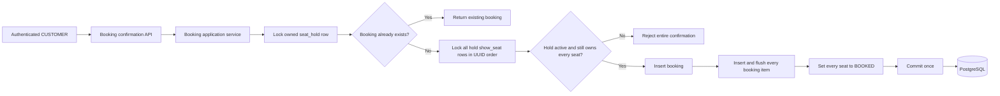
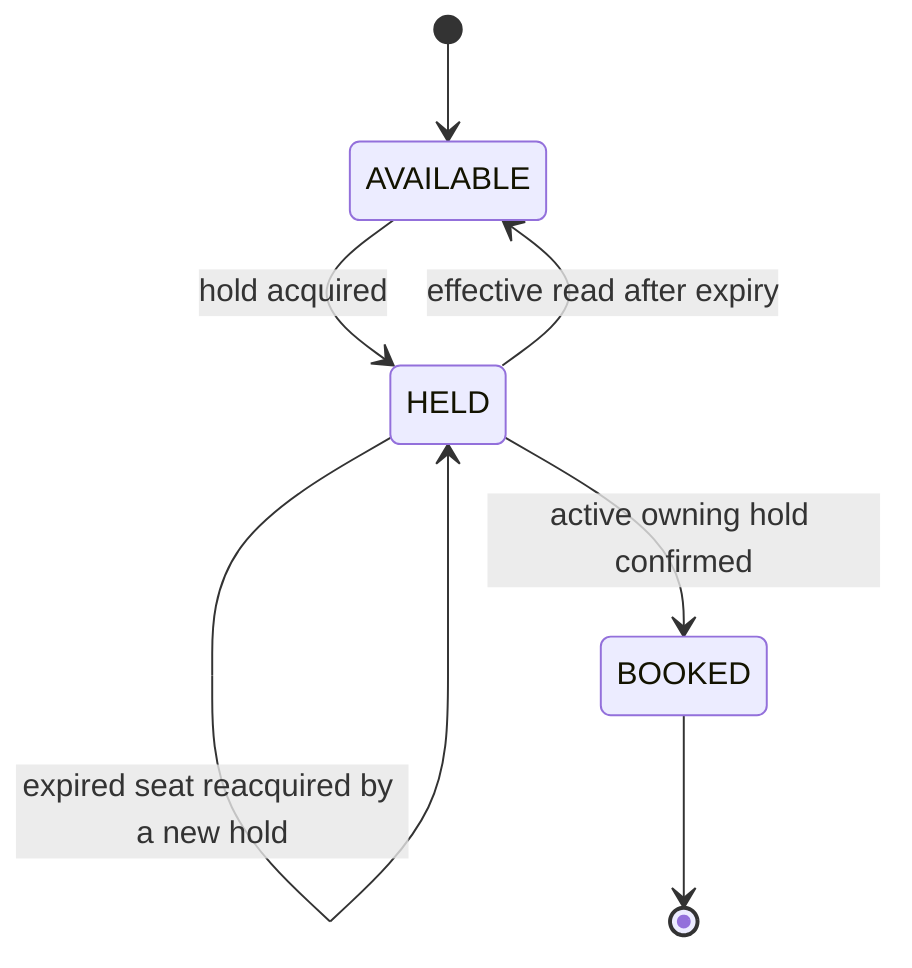
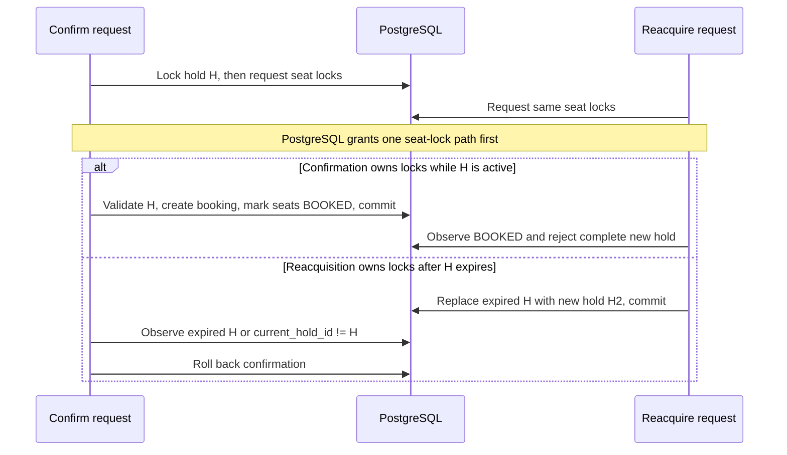

# Booking Confirmation Design

Status: **Implemented**

This document describes the implemented direct hold-to-booking confirmation phase. It builds on the show-seat and customer-hold models.

## 1. Confirmed Requirements

- An authenticated `CUSTOMER` can convert only their own active seat hold into a confirmed booking.
- An authenticated `CUSTOMER` can view only their own booking history.
- Confirmation covers the complete seat set from the hold. Partial confirmation is not allowed.
- No payment is required in this phase; a successful transaction confirms the booking directly.
- The design must remain correct when confirmation, duplicate confirmation, hold expiry, and seat reacquisition happen concurrently.
- PostgreSQL transactions and row locks remain the concurrency authority; no JVM-local lock is used.
- Cancellation is covered separately by the implemented [booking cancellation design](booking-cancellation-design.md). Payment and refund flows remain out of scope. Confirmation and cancellation notifications are covered by the implemented [booking lifecycle notification design](notification-flow-design.md).
- `show_seat.current_booking_id` and the composite foreign key to `booking_item` are retained.
- Persistence order is booking first, then flushed booking items, then show-seat updates.
- Only indexes required by the designed API query paths are added.

## 2. Scope

### 2.1 In scope

- Confirm one active, customer-owned hold as one booking.
- Read a booking owned by the authenticated customer; the separate cancellation flow may have changed it to `CANCELLED`.
- List the authenticated customer's bookings with pagination.
- Persist the booking, its complete seat set, final prices, currency, and confirmation timestamp.
- Move every show seat in the hold from `HELD` to `BOOKED` atomically.
- Make confirmation safe to retry after a lost HTTP response.
- Define database constraints, state changes, API contracts, transaction ordering, errors, and tests.

### 2.2 Out of scope

- Payment initiation, payment authorization, callbacks, or reconciliation.
- Booking cancellation or seat release within the confirmation transaction itself; the separate cancellation flow handles the later state transition.
- Refunds or refund policies.
- Notification logic inside the confirmation transaction; the separate lifecycle-notification flow delivers only after commit and only for newly confirmed or newly cancelled bookings.
- Booking modification, seat replacement, or adding seats to an existing booking.
- Booking expiry or automatic cancellation.
- Administrator booking operations.
- Human-friendly booking reference generation; the booking UUID is the identifier for this phase.

## 3. High-Level Design



The monolith's `booking` package contains the booking API, application service, domain entities, and repositories. It uses the existing `hold` and `show` packages rather than duplicating hold eligibility or show-seat data. To keep package dependencies one-way, the `hold` package defines a synchronous `HoldConversionLookup` interface and the `booking` package implements it using the existing PostgreSQL-backed `BookingRepository`. `SeatHoldService` calls that interface inside its existing read transaction; the lookup does not create a separate transaction or data store.

## 4. State Model

### 4.1 Show-seat state



The `HELD -> AVAILABLE` arrow is an effective read state, not a stored update. The database row may remain `HELD` with an expired `current_hold_id` until another transaction acquires it.

For the confirmation transaction, `BOOKED` is its terminal state. The implemented [booking cancellation design](booking-cancellation-design.md) defines the separate atomic `BOOKED -> AVAILABLE` transition without changing confirmation's invariants.

### 4.2 Hold state

Hold status remains derived rather than persisted:

1. `CONVERTED` when a booking exists for the hold.
2. `ACTIVE` when no booking exists and `requestNow < expiresAt`.
3. `EXPIRED` when no booking exists and `requestNow >= expiresAt`.

`CONVERTED` takes precedence over time. A confirmed hold remains converted after its original expiry timestamp passes.

### 4.3 Booking state

A booking is created directly as `CONFIRMED`. No pending or payment-related state is introduced. The separate cancellation flow can later change it to `CANCELLED` and records `cancelled_at`.

## 5. Data Model

```mermaid
erDiagram
    USER_ACCOUNT ||--o{ BOOKING : owns
    MOVIE_SHOW ||--o{ BOOKING : receives
    SEAT_HOLD ||--o| BOOKING : converts_to
    BOOKING ||--|{ BOOKING_ITEM : contains
    SHOW_SEAT ||--o{ BOOKING_ITEM : recorded_in
    BOOKING o|--o{ SHOW_SEAT : currently_owns

    BOOKING {
        uuid id PK
        uuid source_hold_id UK, FK
        uuid show_id FK
        uuid customer_account_id FK
        varchar status
        numeric total_amount
        varchar currency
        timestamptz confirmed_at
        timestamptz cancelled_at nullable
    }
    BOOKING_ITEM {
        uuid booking_id PK, FK
        uuid show_seat_id PK, FK
        numeric unit_price
    }
    SHOW_SEAT {
        uuid id PK
        varchar availability_status
        uuid current_hold_id FK
        uuid current_booking_id FK
    }
```

### 5.1 `booking`

| Column | PostgreSQL type | Rules |
|---|---|---|
| `id` | `UUID` | Primary key generated by the application. |
| `source_hold_id` | `UUID` | Required FK to `seat_hold(id)` and unique. One hold can produce at most one booking. |
| `show_id` | `UUID` | Required FK to `movie_show(id)`; copied from the hold for direct ownership and query access. |
| `customer_account_id` | `UUID` | Required FK to `user_account(id)`; taken from the authenticated hold owner. |
| `status` | `VARCHAR(20)` | Required; confirmation creates `CONFIRMED`, and the separate cancellation flow may later change it to `CANCELLED`. |
| `total_amount` | `NUMERIC(12,2)` | Required, non-negative sum of all item prices. Java type is `BigDecimal`. |
| `currency` | `VARCHAR(3)` | Required ISO 4217 currency shared by all booked seats. |
| `confirmed_at` | `TIMESTAMPTZ` | Required UTC instant captured from the injected clock after locks are acquired. |
| `cancelled_at` | `TIMESTAMPTZ` | Nullable UTC instant managed only by the separate cancellation flow. |

Storing `source_hold_id` as unique is both a domain constraint and the database backstop for retry safety.

### 5.2 `booking_item`

| Column | PostgreSQL type | Rules |
|---|---|---|
| `booking_id` | `UUID` | Required FK to `booking(id)`; composite primary key. |
| `show_seat_id` | `UUID` | Required FK to `show_seat(id)`; composite primary key. |
| `unit_price` | `NUMERIC(12,2)` | Required, non-negative price copied from the immutable show-seat snapshot. Java type is `BigDecimal`. |

Currency is stored once on the booking because one show already has one currency and confirmation validates that every show seat uses it. Seat row, number, tier, and physical-seat data are not duplicated into `booking_item`; the referenced `show_seat` is already their immutable show-specific snapshot. `seatLabel` remains derived as `rowLabel + seatNumber` and is never persisted.

There is no global unique constraint on `booking_item.show_seat_id`. The current owner is represented by `show_seat.current_booking_id`, following the existing current-hold-pointer model and allowing cancellation to preserve historical items. The confirmation transaction and row locks maintain the one-current-booking invariant.

### 5.3 `show_seat` changes

- Extend `availability_status` to `AVAILABLE`, `HELD`, and `BOOKED`.
- Add nullable `current_booking_id UUID` referencing `booking(id)`.
- Replace the existing state/pointer check with:

```text
(availability_status = AVAILABLE
    AND current_hold_id IS NULL
    AND current_booking_id IS NULL)
OR
(availability_status = HELD
    AND current_hold_id IS NOT NULL
    AND current_booking_id IS NULL)
OR
(availability_status = BOOKED
    AND current_hold_id IS NULL
    AND current_booking_id IS NOT NULL)
```

- Add a composite foreign key from `(current_booking_id, id)` to `booking_item(booking_id, show_seat_id)` after both tables exist. This ensures a seat's current booking pointer names a booking item for that exact seat.

On confirmation, every seat changes from `HELD/current_hold_id = H` to `BOOKED/current_hold_id = NULL/current_booking_id = B` in the same transaction.

### 5.4 Indexes and constraints

- Unique index on `booking(source_hold_id)` for one booking per hold.
- Index on `booking(customer_account_id, confirmed_at DESC, id DESC)` for the owner-scoped history query.
- Primary key on `booking_item(booking_id, show_seat_id)`.
- Check `total_amount >= 0` and `unit_price >= 0`.
- Retain existing hold and show-seat indexes.

No show-level booking index, reverse booking-item index, or standalone `current_booking_id` index is created because none of the APIs in this phase query by those access paths. The composite foreign key references the existing `booking_item(booking_id, show_seat_id)` primary-key index.

## 6. Booking API Contracts

These contracts are implemented and included in the executable Postman collection.

### 6.1 Confirm an owned hold

`POST /api/v1/holds/{holdId}/booking`

Access: authenticated `CUSTOMER` only.

No request body is needed. The authenticated account and path hold identify every input; the client cannot submit seats, price, currency, status, or customer ID.

First successful confirmation: `201 Created`

Headers:

```text
Location: /api/v1/bookings/6e20cc2c-740d-4fd0-85c8-c634c14db44d
```

```json
{
  "id": "6e20cc2c-740d-4fd0-85c8-c634c14db44d",
  "holdId": "973033f0-57bd-4ec3-bf42-d9a24bea39bb",
  "showId": "6e6e5731-8c4b-4bcb-a0cf-f36a45233b6c",
  "status": "CONFIRMED",
  "confirmedAt": "2026-09-25T12:03:00Z",
  "cancelledAt": null,
  "totalPrice": {
    "amount": 500.00,
    "currency": "INR"
  },
  "seats": [
    {
      "showSeatId": "c4d7c07e-56eb-4abf-8aba-3b4a7b631375",
      "rowLabel": "A",
      "seatNumber": 1,
      "seatLabel": "A1",
      "tier": "REGULAR",
      "price": {
        "amount": 250.00,
        "currency": "INR"
      }
    },
    {
      "showSeatId": "d9c35647-f47f-43a5-8321-d4cc55459134",
      "rowLabel": "A",
      "seatNumber": 2,
      "seatLabel": "A2",
      "tier": "REGULAR",
      "price": {
        "amount": 250.00,
        "currency": "INR"
      }
    }
  ]
}
```

An exact retry after the booking exists returns the same representation and `200 OK`; it does not create another booking. This handles a client timeout or lost `201` response without a separate idempotency-key table.

### 6.2 Read an owned booking

`GET /api/v1/bookings/{bookingId}`

Access: authenticated `CUSTOMER` owner only.

Success: `200 OK` with the representation above. A missing booking or another customer's booking returns the same `404 BOOKING_NOT_FOUND` response.

### 6.3 List the authenticated customer's booking history

`GET /api/v1/bookings?page=0&size=20`

Access: authenticated `CUSTOMER` only.

- `page` defaults to `0` and must be zero or greater.
- `size` defaults to `20` and must be between `1` and `100`.
- Ordering is fixed to `confirmedAt DESC, id DESC` so pagination is deterministic. Client-selected sorting is not supported in this phase.
- The repository query always includes `customer_account_id = authenticatedAccountId`; there is no customer-ID request parameter.
- The result includes all of the customer's `CONFIRMED` and `CANCELLED` bookings, including bookings for shows that have already ended.

Success: `200 OK`

```json
{
  "items": [
    {
      "id": "6e20cc2c-740d-4fd0-85c8-c634c14db44d",
      "showId": "6e6e5731-8c4b-4bcb-a0cf-f36a45233b6c",
      "status": "CONFIRMED",
      "confirmedAt": "2026-09-25T12:03:00Z",
      "cancelledAt": null,
      "totalPrice": {
        "amount": 500.00,
        "currency": "INR"
      },
      "seatCount": 2
    }
  ],
  "page": 0,
  "size": 20,
  "totalElements": 1,
  "totalPages": 1
}
```

History uses a compact summary and does not embed seat items. The client can use `GET /api/v1/bookings/{bookingId}` for the complete seat set. The `seatCount` is calculated in the set-based history query; it must not introduce one count query per booking.

### 6.4 Related existing responses

- `GET /api/v1/holds/{holdId}` gains the derived hold status `CONVERTED` after successful confirmation.
- `GET /api/v1/shows/{showId}/seats` returns `BOOKED` for a confirmed seat and never exposes hold ID, booking ID, or customer identity.
- Show detail and show search exclude `BOOKED` seats from available-seat counts.

## 7. Confirmation Transaction

The transaction uses both the owned hold row and its complete ordered show-seat set as concurrency boundaries.

1. Authenticate a `CUSTOMER`; obtain `customerAccountId` only from the verified JWT.
2. Select the `seat_hold` by `holdId` and `customerAccountId` with `FOR UPDATE`. A missing or foreign-owned hold returns `HOLD_NOT_FOUND`.
3. While holding that row lock, query `booking` by `source_hold_id`.
4. If a booking already exists, return it as an idempotent `200 OK` result. This check precedes expiry evaluation so a retry remains successful after the original hold deadline.
5. Read the immutable `seat_hold_item` IDs and lock all corresponding `show_seat` rows in ascending UUID order using one `FOR UPDATE OF show_seat` query.
6. After all locks are acquired, capture `confirmedAt = clock.instant()` exactly once.
7. Require `confirmedAt < hold.expiresAt`. Equality is expired, matching the existing hold boundary.
8. Require `confirmedAt < show.startsAt`; confirmation closes when the show starts even if configuration allowed a hold deadline beyond that instant.
9. Require at least one seat and require every locked seat to:
   - belong to the hold's show;
   - have stored status `HELD`; and
   - have `current_hold_id = hold.id`.
10. Validate that all seats use the show's currency. Calculate each `unit_price` from the immutable show-seat price and calculate `total_amount` with `BigDecimal`.
11. Create and persist one `booking`.
12. Create and persist every `booking_item`, then explicitly flush the booking and complete item set. The booking insert is executed before its item inserts because the items reference it.
13. Only after the item flush succeeds, update every locked show seat to `BOOKED`, clear `current_hold_id`, and set `current_booking_id` to the new booking ID. This ordering is required because the composite foreign key from the show seat must reference an already-inserted booking item for that exact seat.
14. Flush the show-seat updates and commit once. Return the booking only after successful commit.

Any validation failure or database error rolls back the booking, every item, and every show-seat change. There is no partial confirmation.

### 7.1 Required lock order

Every booking-confirmation path must use this order:

```text
seat_hold row -> show_seat rows ordered by UUID
```

The existing hold-acquisition path locks show-seat rows but does not take write locks on old hold rows, so it does not introduce the reverse lock order. New code must not add a `show_seat -> seat_hold FOR UPDATE` path without revisiting deadlock analysis.

## 8. Concurrency Analysis

### 8.1 Two confirmations for the same hold

```mermaid
sequenceDiagram
    participant A as Request A
    participant DB as PostgreSQL
    participant B as Request B

    A->>DB: Lock hold H
    DB-->>A: Lock granted
    B->>DB: Lock hold H
    Note over B,DB: Waits
    A->>DB: Lock H seats, insert booking B1, set seats BOOKED
    A->>DB: Commit
    DB-->>B: Hold lock granted
    B->>DB: Find B1 by unique source_hold_id
    DB-->>B: Return existing B1; no writes
```

The hold lock provides serialization. The unique `booking.source_hold_id` constraint is a final database safeguard.

### 8.2 Confirmation races with expired-seat reacquisition



Time is evaluated only after required seat locks are held. Therefore, a request that spent its remaining hold lifetime waiting cannot confirm using an earlier timestamp.

### 8.3 Exact expiry boundary

At `confirmedAt == expiresAt`, confirmation fails with `HOLD_EXPIRED`. At that same boundary the seat is eligible for a new hold. Row locking decides which transaction observes and changes the seat first, while the shared boundary rule prevents both from succeeding.

### 8.4 Failure and retry

- Failure before commit leaves no booking and no booked seats.
- Failure after commit but before the HTTP response may be indistinguishable to the client from rollback.
- Retrying the same endpoint returns the booking associated with `source_hold_id`.
- A retry never uses current time to invalidate an already-created booking.

## 9. Error Contract

The feature continues to use the existing `application/problem+json` envelope.

| HTTP status | Code | When |
|---:|---|---|
| 401 | `INVALID_TOKEN` / `TOKEN_EXPIRED` | No valid customer authentication is present. |
| 403 | `FORBIDDEN` | The authenticated role is not `CUSTOMER`. |
| 404 | `HOLD_NOT_FOUND` | The hold does not exist or is not owned by the customer. |
| 404 | `BOOKING_NOT_FOUND` | The booking does not exist or is not owned by the customer. |
| 409 | `HOLD_EXPIRED` | No booking exists and the hold is expired at the post-lock timestamp. |
| 409 | `HOLD_NO_LONGER_OWNS_SEATS` | No booking exists and one or more hold seats are no longer currently assigned to this hold. |
| 409 | `SHOW_ALREADY_STARTED` | No booking exists and the show has started. |

A repeated request for a successfully converted hold is not a conflict; it returns the existing booking.

## 10. Security and Data Exposure

- All three endpoints require role `CUSTOMER`.
- Ownership is part of the locking/read repository query, not a later controller-only check.
- Cross-customer hold and booking access uses not-found responses to avoid exposing resource existence.
- The API never accepts customer ID, show ID, seat IDs, price, currency, total, status, or confirmation time during conversion.
- Public and customer responses expose `showSeatId`, never `physicalSeatId`.
- Responses do not expose `current_hold_id`, `current_booking_id`, or another customer's identity.

## 11. Query and Read-Model Changes

### 11.1 Effective show-seat availability

At `requestNow`:

```text
AVAILABLE when stored status is AVAILABLE
AVAILABLE when stored status is HELD and current hold expiresAt <= requestNow
HELD      when stored status is HELD and current hold expiresAt > requestNow
BOOKED    when stored status is BOOKED
```

`BOOKED` is never treated as effectively available in this phase.

### 11.2 Available-seat aggregates

Show detail and show search continue to count only:

```text
stored AVAILABLE
OR (stored HELD AND current hold is expired)
```

Stored `BOOKED` rows contribute zero. The aggregate stays in the existing set-based query and must not add per-show queries.

### 11.3 Booking reads

Booking detail should fetch the owned booking and its items/show-seat display fields with a bounded joined query or batch query. It must not issue one query per booking item. `seatLabel` is generated in the response.

Booking history uses the composite owner/time index and a fixed `confirmed_at DESC, id DESC` order. Its content query returns booking summaries and set-based seat counts for one page. Pagination may execute one additional count query, but the query count must not grow with the number of bookings returned.

## 12. Flyway Migration

The append-only `V6__create_confirmed_bookings.sql` migration applies the following changes in order:

1. Create `booking` with its foreign keys, checks, unique `source_hold_id`, and indexes.
2. Add nullable `show_seat.current_booking_id` referencing `booking(id)`.
3. Replace the show-seat availability and pointer checks to include `BOOKED`.
4. Create `booking_item` with its primary key, foreign keys, and amount check.
5. Add the composite show-seat current-booking-to-item foreign key.

Flyway remains the schema owner and Hibernate remains on `ddl-auto: validate`.

## 13. Test Strategy

### 13.1 Functional and security

- A customer confirms their own active single-seat and multi-seat holds.
- Anonymous and theatre-admin callers cannot confirm, read, or list bookings.
- A customer cannot confirm or read another customer's resources.
- Booking history contains only the authenticated customer's bookings, in deterministic newest-first order, with validated pagination.
- Booking total, currency, item prices, and derived labels match the show-seat snapshots.
- A confirmed booking remains readable after the source hold's expiry.

### 13.2 State and atomicity

- Confirmation creates exactly one booking and the complete item set.
- Booking and every booking item are flushed successfully before any show-seat row receives `current_booking_id`.
- Every hold seat becomes `BOOKED`, clears its hold pointer, and references the new booking.
- Any item insert or seat update failure rolls back the complete transaction.
- Expired, already-reacquired, partially mismatched, and started-show cases create no booking and change no seats.
- Public seat results show `BOOKED`; show availability counts decrease correctly.
- The source hold reads as `CONVERTED` after commit.

### 13.3 PostgreSQL concurrency

- Two simultaneous confirmations for one hold produce one booking; one response creates it and the retry returns the same resource.
- Confirmation racing with reacquisition of an expired seat produces exactly one valid winner.
- Confirmation waiting beyond the expiry boundary fails rather than using a timestamp captured before waiting.
- Disjoint holds can confirm independently.
- Multi-seat locking follows UUID order and does not partially book a seat set.

### 13.4 Query efficiency

- Booking history returns seat counts in its set-based page query and does not issue one query per booking.
- Booking detail does not issue one query per booking item.
- The history page uses at most one content query and one pagination count query.

These concurrency tests require PostgreSQL Testcontainers; an in-memory database cannot validate the required lock behavior.

## 14. Design Decisions Recorded for Implementation

The revised design records the following implementation decisions:

1. Use `POST /api/v1/holds/{holdId}/booking` with no request body because the owned hold is the complete command input.
2. Make confirmation naturally retry-safe: return `201` for creation and `200` with the same booking for a later retry.
3. Add `GET /api/v1/bookings/{bookingId}` for detail and owner-scoped `GET /api/v1/bookings` for paginated history.
4. Reject confirmation once the show starts, even if a misconfigured hold duration extends beyond show start.
5. Derive hold status `CONVERTED` from booking existence instead of storing mutable hold status.
6. Persist booking status as `CONFIRMED`, total amount, currency, and per-item unit price; do not persist derived `seatLabel`.
7. Add `show_seat.current_booking_id` to make current ownership and database pointer consistency explicit.
8. Do not require a client idempotency key for this one-booking-per-hold command; the unique hold relationship supplies its idempotency boundary.
9. Persist and flush the booking items before updating `show_seat.current_booking_id`, as required by the retained composite foreign key.

These decisions are implemented in the booking flow.
