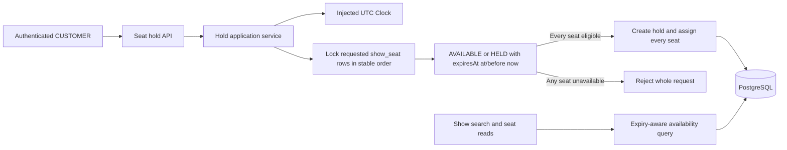
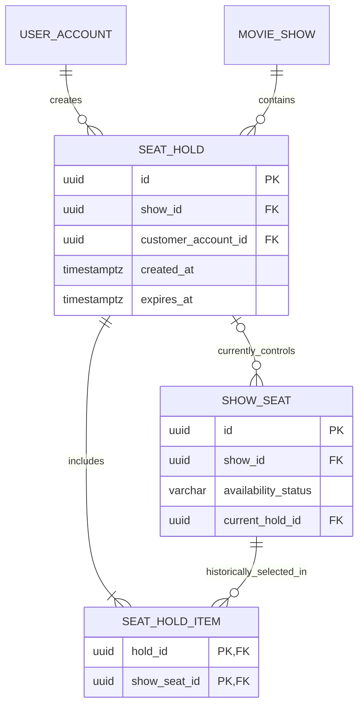
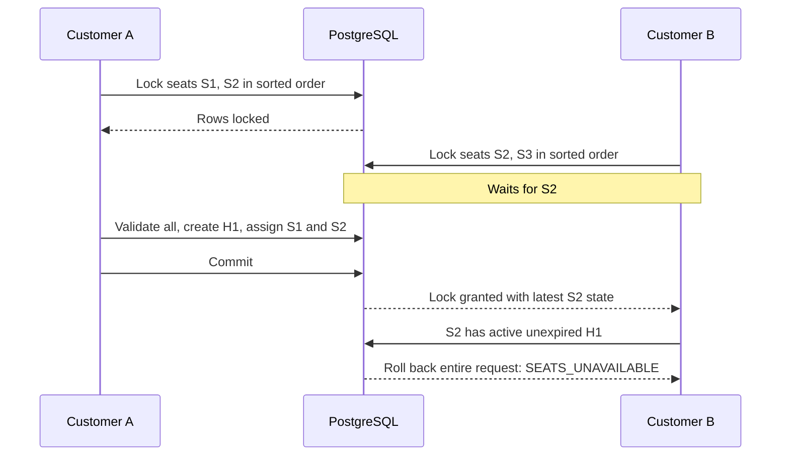

# Customer Seat Hold Design

Status: **Implemented**

This document describes the implemented customer seat-hold phase that follows show-seat inventory.

## 1. Confirmed Requirements

- An authenticated `CUSTOMER` can temporarily hold one or more seats for one show.
- A request is all-or-nothing. It must never hold only a subset of the requested seats.
- When customers concurrently request an overlapping seat set, at most one request may acquire each seat. A losing request is rejected in full.
- Hold duration is externally configurable rather than hard-coded.
- PostgreSQL transaction row locking provides concurrency correctness.
- Expiry is evaluated from stored expiry timestamps during availability and acquisition queries.
- Expired holds must stop blocking seats without relying on a cron job or scheduled cleanup task.
- Holds operate on `show_seat.id`, never on `physical_seat.id`.
- Existing UTC persistence and the injected UTC `Clock` remain the time model.

## 2. Scope

### 2.1 In scope

- Create a temporary hold for one or more show-seat IDs.
- Read a customer's own hold.
- Return the hold expiry and the complete held-seat set.
- Make public show-seat availability and show-search availability counts expiry-aware.
- Preserve all-or-nothing behavior under contention.
- Implement the persistence model, API contracts, locking order, error contract, configuration, and tests.

### 2.2 Out of scope

- Booking confirmation or conversion of a hold into a booking.
- Payment initiation, payment callbacks, or payment timeout behavior.
- Hold extension or refresh.
- Explicit hold release/cancellation.
- A background expiry worker, cron job, or scheduled cleanup process.
- Waitlists, seat recommendations, adjacent-seat selection, or automatic seat substitution.
- Administrator-created holds.
- Per-customer rate limiting or abuse prevention.
- Deleting historical expired holds.

## 3. High-Level Design



The application remains a monolith. The `hold` package owns hold contracts and use cases, while the existing `show` package remains responsible for show-seat inventory and public discovery queries.

## 4. Effective Availability Model

Expiry is derived from the configured hold deadline; it is not a scheduled state transition.

A show seat is effectively available at a captured `requestNow` when either:

```text
showSeat.availabilityStatus = AVAILABLE
OR
(
  showSeat.availabilityStatus = HELD
  AND currentHold.expiresAt <= requestNow
)
```

A show seat is effectively held when its stored state is `HELD` and its current hold has `expiresAt > requestNow`.

The expiry boundary is exclusive: a hold is active only while `requestNow < expiresAt`; it is expired when `requestNow >= expiresAt`. Every use case captures `clock.instant()` once and uses that value for every comparison and timestamp in the transaction.

An expired row may still store `HELD` and its old `current_hold_id`. That is intentional. Reads calculate effective availability with the expression above, and the next successful hold transaction replaces the expired pointer. Correctness therefore does not depend on asynchronous cleanup.

## 5. Domain Model



### 5.1 `seat_hold` table

| Column | Type | Rules |
|---|---|---|
| `id` | `UUID` | Primary key. |
| `show_id` | `UUID` | Required FK to `movie_show(id)`. All items must belong to this show. |
| `customer_account_id` | `UUID` | Required FK to `user_account(id)`; authenticated customer owner. |
| `created_at` | `TIMESTAMPTZ` | Required UTC instant captured from the injected clock. |
| `expires_at` | `TIMESTAMPTZ` | Required UTC instant; strictly later than `created_at`. |

There is no persisted `EXPIRED` state. Expiry is calculated from `expires_at`. Booking-related states are deferred until booking is designed.

### 5.2 `seat_hold_item` table

| Column | Type | Rules |
|---|---|---|
| `hold_id` | `UUID` | Required FK to `seat_hold(id)`; composite primary key. |
| `show_seat_id` | `UUID` | Required FK to `show_seat(id)`; composite primary key. |

The table records the immutable seat set requested by a hold. It does not have a global unique constraint on `show_seat_id`, because one seat may appear in multiple historical holds after older holds expire. The current owner is identified by `show_seat.current_hold_id`, protected by row locking.

### 5.3 Changes to `show_seat`

- Extend `availability_status` from only `AVAILABLE` to `AVAILABLE` and `HELD` for this phase.
- Add nullable `current_hold_id UUID` referencing `seat_hold(id)`.
- Add a consistency constraint:

```text
(availability_status = AVAILABLE AND current_hold_id IS NULL)
OR
(availability_status = HELD AND current_hold_id IS NOT NULL)
```

The existing show-seat price, currency, tier, row label, and seat number remain immutable snapshots. No customer ID or duplicated expiry timestamp is stored on every seat.

### 5.4 Indexes

- `seat_hold(customer_account_id, created_at DESC, id)` for customer-owned reads.
- `seat_hold(show_id, expires_at, id)` for show-scoped expiry checks.
- `seat_hold_item(hold_id, show_seat_id)` through its primary key.
- `seat_hold_item(show_seat_id, hold_id)` for historical seat-to-hold lookup.
- `show_seat(current_hold_id)` for the current-hold relationship.
- Retain the existing `show_seat(show_id, availability_status)` and ordered show-seat indexes.

## 6. Hold-Creation Transaction

The transaction uses the requested `show_seat` rows as the concurrency boundary.

1. Authenticate a `CUSTOMER`; take `customerAccountId` only from the verified JWT.
2. Validate that the requested list is non-empty, contains no nulls, and contains no duplicate IDs.
3. Verify the show exists, then sort the requested seat IDs into a stable database order.
4. Select all requested rows for the path's `showId` using a PostgreSQL pessimistic write lock equivalent to `FOR UPDATE OF show_seat`, ordered by ID.
5. After every lock is acquired, capture `acquiredAt = clock.instant()` once and calculate `expiresAt = acquiredAt + configuredHoldDuration`. Capturing time after a lock wait prevents the wait from consuming the customer's hold duration.
6. Verify that the show has not started at `acquiredAt`.
7. Require the locked-row count to equal the requested distinct-ID count. A missing ID or a seat from another show rejects the request.
8. For each locked row, evaluate effective availability using its stored state and current hold's `expires_at` against the captured `acquiredAt`.
9. If any row is not effectively available, throw `SEATS_UNAVAILABLE`. Do not insert a hold or update any seat.
10. Insert one `seat_hold` row with `created_at = acquiredAt` and one `seat_hold_item` row for every requested seat.
11. Update every requested `show_seat` to `HELD` with the new `current_hold_id`.
12. Commit once. Return the complete hold only after a successful commit.

The lock query deliberately does not filter out unavailable rows before locking. It locks the exact requested set first, then validates the latest row state. This makes it possible to distinguish a complete eligible set from a partial result without ever partially writing.

All code paths that assign a current hold must follow this transaction. No JVM-local lock is used.

### 6.1 Deadlock prevention

Overlapping multi-seat requests can acquire the same rows in different caller-supplied orders. The repository query therefore locks rows in ascending `show_seat.id` order. The application does not issue one lock query per seat.

### 6.2 Concurrent example



If Customer A rolls back instead, Customer B observes the seats as available and may acquire its complete set.

## 7. API Contracts

These contracts are implemented and included in the executable Postman collection.

### 7.1 Create a hold

`POST /api/v1/shows/{showId}/holds`

Access: authenticated `CUSTOMER` only.

Request:

```json
{
  "showSeatIds": [
    "c4d7c07e-56eb-4abf-8aba-3b4a7b631375",
    "d9c35647-f47f-43a5-8321-d4cc55459134"
  ]
}
```

Success: `201 Created`

```json
{
  "id": "973033f0-57bd-4ec3-bf42-d9a24bea39bb",
  "showId": "6e6e5731-8c4b-4bcb-a0cf-f36a45233b6c",
  "createdAt": "2026-09-25T12:00:00Z",
  "expiresAt": "2026-09-25T12:05:00Z",
  "status": "ACTIVE",
  "seats": [
    {
      "showSeatId": "c4d7c07e-56eb-4abf-8aba-3b4a7b631375",
      "rowLabel": "A",
      "seatNumber": 1,
      "seatLabel": "A1",
      "tier": "REGULAR",
      "price": {
        "amount": 250.00,
        "currency": "INR"
      }
    },
    {
      "showSeatId": "d9c35647-f47f-43a5-8321-d4cc55459134",
      "rowLabel": "A",
      "seatNumber": 2,
      "seatLabel": "A2",
      "tier": "REGULAR",
      "price": {
        "amount": 250.00,
        "currency": "INR"
      }
    }
  ]
}
```

The example timestamps are illustrative and do not establish a five-minute duration.

`status` is derived for the response: `ACTIVE` before `expiresAt`, otherwise `EXPIRED`. It is not a persisted expiry status. `seatLabel` remains response-only.

### 7.2 Read an owned hold

`GET /api/v1/holds/{holdId}`

Access: authenticated `CUSTOMER` owner only. A missing hold or a hold owned by another customer returns the same `404 HOLD_NOT_FOUND` response.

The response uses the same representation as hold creation, with status derived using a newly captured UTC clock instant.

### 7.3 Existing show-seat availability response

`GET /api/v1/shows/{showId}/seats` remains public. Its `availability` value is effective rather than merely echoing the stored value:

- `AVAILABLE` for a stored available seat.
- `AVAILABLE` for a stored held seat whose current hold has expired.
- `HELD` for a stored held seat whose current hold is still active.

The public response does not expose `holdId`, customer identity, or `expiresAt`.

## 8. Security and Ownership

- Hold creation and hold detail require a valid JWT with role `CUSTOMER`.
- A theatre administrator cannot create a customer hold.
- The customer account ID is taken only from the authenticated principal.
- Hold detail is owner-scoped at the repository query; cross-customer access is treated as not found.
- The API never accepts a customer account ID, price, currency, availability state, or expiry from the client.
- Show-seat IDs are public identifiers, but all must belong to the `showId` in the URL.

## 9. Error Contract

The feature reuses the existing `application/problem+json` envelope.

| HTTP status | Code | When |
|---:|---|---|
| 400 | `VALIDATION_FAILED` | Seat list is empty, contains nulls, or contains duplicates. |
| 401 | `INVALID_TOKEN` / `TOKEN_EXPIRED` | No valid customer authentication is present. |
| 403 | `FORBIDDEN` | Authenticated role is not `CUSTOMER`. |
| 404 | `SHOW_NOT_FOUND` | Show does not exist. |
| 404 | `HOLD_NOT_FOUND` | Hold does not exist or is not owned by the caller. |
| 409 | `SHOW_ALREADY_STARTED` | The show has started, so new holds are closed. |
| 409 | `SEATS_UNAVAILABLE` | At least one requested seat is missing from the show, actively held, or otherwise unavailable. No seat is held. |

The conflict response is intentionally all-or-nothing and does not return a successful subset.

## 10. Configuration and Time

Spring configuration shape:

```yaml
booking:
  hold-duration: ${BOOKING_HOLD_DURATION}
```

The value maps to a validated Java `Duration`. `BOOKING_HOLD_DURATION` is required; the application has no hard-coded default. Startup fails if the configured duration is absent, zero, or negative.

All persisted timestamps use `TIMESTAMPTZ` and UTC instants. Application logic uses the injected UTC `Clock`; it does not call `Instant.now()` directly. `Asia/Kolkata` date interpretation remains limited to show search and has no role in hold expiry.

## 11. Query Implementation

### 11.1 Show-seat listing

Fetch each show seat and its current hold's expiry in one left-joined query, then derive availability against the single `requestNow` captured by the service. The left join is required because an `AVAILABLE` seat has no current hold.

### 11.2 Show-search available-seat count

The aggregate search query counts both:

- seats stored as `AVAILABLE`; and
- seats stored as `HELD` whose current hold has `expires_at <= requestNow`.

It remains one aggregate content query and does not introduce a per-show hold lookup.

Conceptually, the aggregate becomes:

```text
SUM(
  CASE WHEN availability_status = AVAILABLE
         OR (availability_status = HELD AND current_hold.expires_at <= requestNow)
       THEN 1
       ELSE 0
  END
)
```

### 11.3 Hold acquisition

Lock all requested show-seat rows in a single ordered query. Load the referenced current holds without issuing a query per seat. Validate the whole locked set before the first write.

## 12. Transaction and Failure Guarantees

- PostgreSQL is the concurrency authority.
- The transaction boundary covers locking, eligibility validation, hold creation, item creation, and every show-seat update.
- Any exception rolls back the complete hold and every seat assignment.
- An HTTP timeout or client disconnect does not imply failure; the owned-hold lookup is the available read path. Create-hold idempotency is not implemented.
- Expiry alone never requires a database write. Reacquisition replaces the expired current-hold pointer while preserving old hold items.
- `READ COMMITTED` with pessimistic row locks is the isolation model; a higher global isolation level is not required for the described row-level invariant.

## 13. Test Strategy

### 13.1 Validation and authorization

- Anonymous and theatre-admin callers cannot create holds.
- A customer can request one or multiple seats.
- Empty, null, duplicate, cross-show, and unknown seat sets fail with no writes.
- A hold can only be read by its customer owner.
- A show at or after its start time rejects new holds.

### 13.2 Atomicity

- All requested available seats are assigned to one hold.
- If one requested seat is unavailable, no hold or hold item is inserted and no requested seat changes.
- A failure while inserting items or updating seats rolls back the entire transaction.

### 13.3 PostgreSQL concurrency

- Two simultaneous requests for the same single seat produce one success and one `SEATS_UNAVAILABLE`.
- Two overlapping multi-seat requests never both acquire the shared seat and the loser acquires no non-overlapping subset.
- Disjoint requests can complete independently.
- Opposite caller-supplied seat order does not deadlock because locking uses stable database order.
- A waiting transaction evaluates the latest committed hold after acquiring the row locks.

### 13.4 Expiry

- An active hold blocks another customer.
- At the exact `expiresAt` instant, the seat is effectively available.
- An expired hold no longer affects public availability or aggregate available-seat counts.
- A customer can acquire a seat whose previous hold expired, without a cleanup job.
- The old hold remains readable as expired and retains its historical item set.
- Tests use a fixed or mutable injected UTC clock rather than sleeping.

### 13.5 Query efficiency

- Multi-seat acquisition uses one ordered lock query rather than one query per seat.
- Public seat listing obtains effective availability without one hold query per seat.
- Show search retains its aggregate-query behavior with expiry-aware counts.

PostgreSQL Testcontainers is required for lock-wait and concurrent transaction tests; an in-memory database is not an acceptable substitute.

## 14. Flyway Migration

The append-only `V5__create_customer_seat_holds.sql` migration:

1. Create `seat_hold`.
2. Extend the `show_seat.availability_status` check to include `HELD`.
3. Add nullable `show_seat.current_hold_id` and its foreign key/index.
4. Add the show-seat state/pointer consistency constraint.
5. Create `seat_hold_item` and its indexes.

Hibernate continues to use `ddl-auto: validate`; Flyway remains the schema owner.

## 15. Implemented Decisions and Deferred Policies

The first implementation makes the following explicit choices:

1. Hold duration is required positive configuration with no application default or upper bound.
2. There is no hard seat-count cap in this phase.
3. A customer may own multiple simultaneously active holds, including for the same show.
4. `GET /api/v1/holds/{holdId}` is implemented and owner-scoped.
5. Explicit early release is not implemented.
6. Create-hold idempotency keys are not implemented.
7. `SEATS_UNAVAILABLE` is deliberately generic and does not identify individual losing seats.
8. PostgreSQL's configured lock-wait behavior is used; the application does not define a custom lock timeout or timeout-specific API error.

Booking conversion, including how it locks an active hold and prevents expiry races during payment, requires a separate design before implementation.
