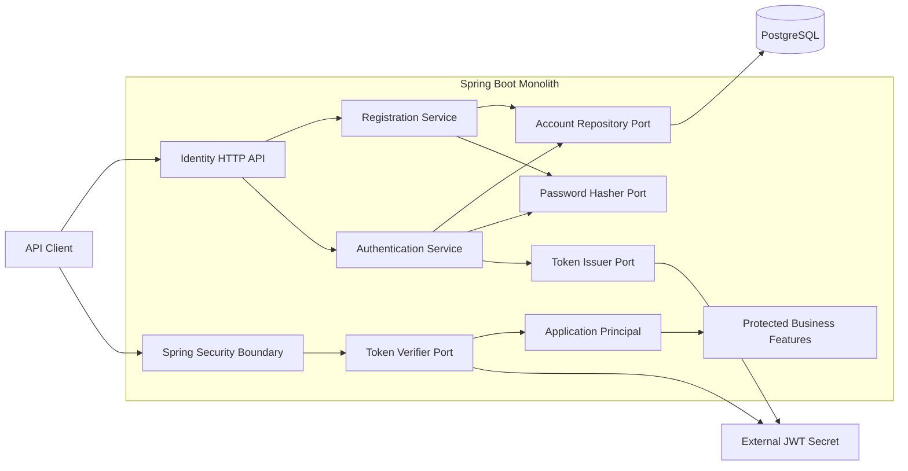
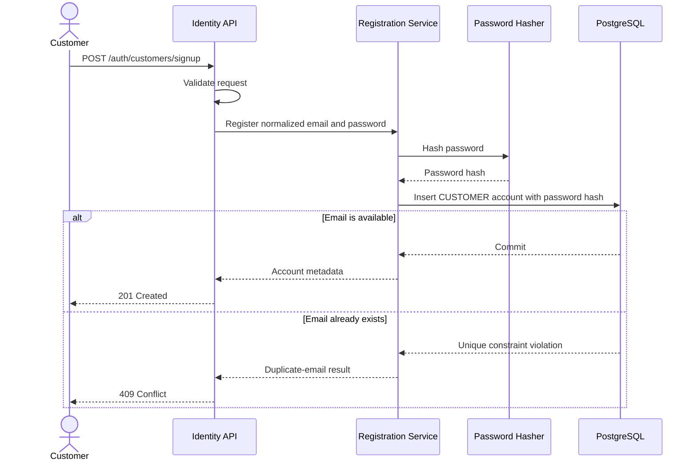
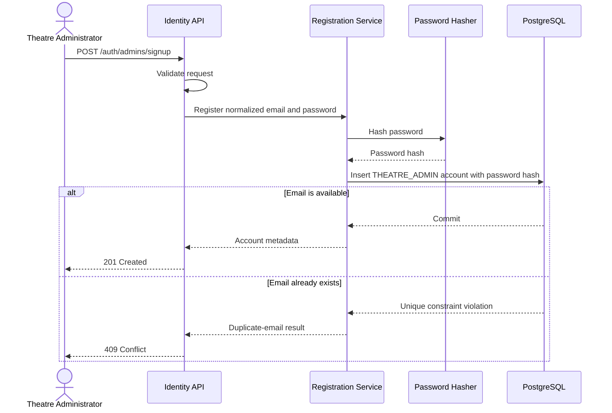
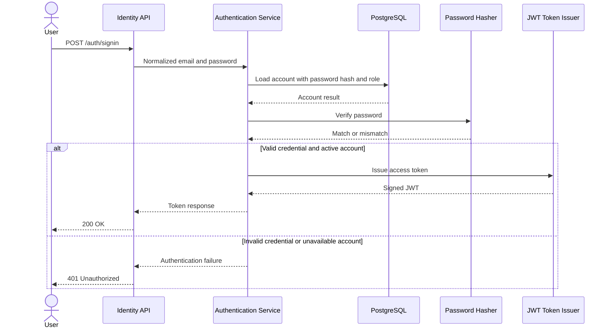
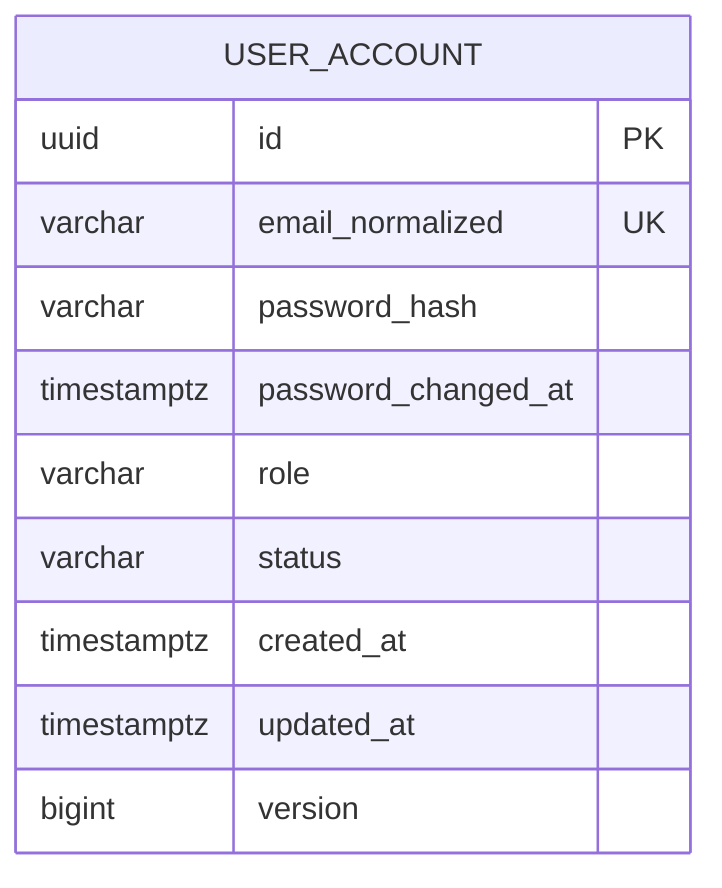

# Identity and Authentication Design Proposal

- **Status:** Approved and implemented
- **Scope:** Customer and theatre-administrator identity, signup, sign-in, JWT authentication, and authorization handoff
- **Implementation status:** Implemented in the identity capability
- **Last updated:** 2026-09-22

## 1. Purpose

This document records the approved and implemented first identity and authentication design for the movie-ticketing platform, together with its alternatives and deferred scope.

The design was approved for implementation. Sections that describe possible later work remain explicitly marked as out of scope.

## 2. Confirmed requirements

The following points come directly from the assignment or the current design direction:

- The platform has customer and theatre-administrator users.
- Customers and theatre administrators need separate signup flows and a shared sign-in flow.
- Authentication will initially use JSON Web Tokens (JWTs).
- The first version should remain simple.
- The implementation should allow another authentication mechanism to be added later without rewriting business features.
- Both user types are stored in one account table and distinguished by role.
- The password hash is stored in the account table.
- Customer and theatre-administrator signup are both open/public.
- Role-based access control is required for customer and theatre-administrator operations.
- The application remains a Java 21, Spring Boot, Maven, PostgreSQL, Flyway monolith.

## 3. Goals

- Create customer and theatre-administrator accounts through separate public endpoints.
- Authenticate an email/password credential and issue a short-lived JWT access token.
- Authenticate API requests carrying a valid bearer token.
- Expose a stable application principal to the rest of the monolith.
- Include the account ID and role in the issued JWT.
- Enforce the `CUSTOMER` and `THEATRE_ADMIN` roles at API and use-case boundaries.
- Keep password authentication, token issuance, and token verification behind replaceable contracts.
- Store only password hashes, never plaintext passwords.
- Produce predictable validation and authentication errors without leaking credentials or tokens.
- Define transaction and concurrency behavior for duplicate signup.

## 4. Non-goals for the first version

The following are out of scope for this iteration:

- OAuth 2.0 or OpenID Connect login.
- Social login.
- Single sign-on or multi-factor authentication.
- Email or phone verification.
- Password reset and account recovery.
- Refresh tokens and server-side sessions.
- A token revocation list.
- Device/session management.
- Fine-grained permissions beyond `CUSTOMER` and `THEATRE_ADMIN`.
- Separate customer, theatre-admin, or local-credential tables.
- Mapping theatre administrators to owned theatres or defining their business permissions inside the identity capability. Ownership is implemented separately by the [theatre administration design](theatre-admin-management-design.md).
- Machine-to-machine identities.
- A user-profile model beyond the identity data required for authentication.
- Rate-limiting infrastructure. Authentication endpoints should remain compatible with adding it later.

These exclusions keep the first mechanism small. They do not prevent later additions through the extension points described below.

## 5. Implemented decisions at a glance

| Area | Proposal | Status |
|---|---|---|
| Login identifier | Normalized email address | Implemented |
| Account storage | One `user_account` table for both user types | Implemented |
| Password storage | Password hash in `user_account` | Implemented |
| User roles | Exactly one of `CUSTOMER` or `THEATRE_ADMIN` per account | Implemented |
| Customer signup | Separate public endpoint | Implemented |
| Theatre-admin signup | Separate public endpoint | Implemented |
| Sign-in | One public endpoint for both roles | Implemented |
| Signup result | Account metadata only; user signs in separately | Implemented |
| Access token | JWT bearer token | Implemented |
| Token signing | HMAC SHA-256 with an external Base64 secret | Implemented |
| Access-token lifetime | 15 minutes | Implemented |
| Refresh token | Not included | Implemented scope |
| Logout | Client discards the token; no server endpoint | Implemented scope |
| Password hashing | BCrypt with work factor 12 | Implemented |
| Email verification | Not included | Implemented scope |
| Account states | `ACTIVE`, `DISABLED` | Implemented |

## 6. Identity boundaries

The identity capability owns:

- Accounts, password hashes, and account status in one table.
- Customer and theatre-administrator roles.
- Signup and sign-in orchestration.
- JWT issuance and verification.
- Conversion of an authenticated identity into an application principal.

The identity capability does not own customer booking history, theatre administration data, theatre-to-admin assignments, payments, or other business entities. Other capabilities should reference the authenticated account by immutable account ID. A `THEATRE_ADMIN` role identifies the account type; it does not grant ownership of every theatre by itself.

## 7. High-level design

### 7.1 Components



### 7.2 Architectural approach

The rest of the application should depend on a small, mechanism-neutral principal rather than on JWT claims or password-specific classes.

Conceptually, an authenticated principal contains:

- `accountId`
- `role`
- `authenticationMethod`

JWT-specific parsing remains at the security boundary. Password verification remains inside the password authentication mechanism. A future OAuth/OIDC mechanism can produce the same application principal without changing booking or administration use cases.

### 7.3 Pluggability boundary

The implemented logical contracts are:

| Contract | Responsibility | Initial implementation |
|---|---|---|
| Authentication mechanism | Validate a presented credential and return an authenticated identity | Email/password |
| Password hasher | Hash and verify passwords | BCrypt |
| Token issuer | Issue an access credential from an authenticated identity | JWT issuer |
| Token verifier | Validate an access credential and return an application principal | JWT verifier |
| Account repository | Read and persist the shared account record, including its local password hash | PostgreSQL |

These are logical boundaries, not a requirement to create one interface per table or over-abstract the first implementation. Spring Security's authentication-provider model can be used where it fits these responsibilities. A future mechanism may introduce its own storage only when needed; separate credential storage is explicitly out of scope for the first version.

## 8. User flows

### 8.1 Customer signup

**Implemented endpoint:** `POST /api/v1/auth/customers/signup`

1. Validate the request shape and password policy.
2. Normalize the email address.
3. Hash the password.
4. Create an `ACTIVE` account with role `CUSTOMER` and its password hash.
5. Return public account metadata with `201 Created`.
6. The customer signs in separately to obtain an access token.

The database unique constraint is the final authority for duplicate emails. A race between two signup requests results in one success and one `409 Conflict`.



### 8.2 Theatre-administrator signup

**Implemented endpoint:** `POST /api/v1/auth/admins/signup`

This is a public signup endpoint for theatre administrators. The role is fixed by the endpoint and is never accepted from the request body.

1. Validate the request shape and password policy.
2. Normalize the email address.
3. Hash the password.
4. Create an `ACTIVE` account with role `THEATRE_ADMIN` and its password hash.
5. Return public account metadata with `201 Created`.
6. The theatre administrator signs in through the shared sign-in endpoint.

The identity flow does not decide which theatre the administrator manages. That relationship and its authorization rules belong to the separate [theatre administration design](theatre-admin-management-design.md).



### 8.3 Sign-in

**Implemented endpoint:** `POST /api/v1/auth/signin`

1. Validate and normalize the email.
2. Load the shared account record, including its password hash and role.
3. Verify the password hash. When the account is absent, perform a dummy hash verification to reduce timing differences.
4. Reject invalid credentials using one generic public error.
5. Reject a disabled account without issuing a token. The public response should not reveal whether the email or password was the cause.
6. Issue a short-lived JWT containing the account ID and role.
7. Return the bearer token and its lifetime.



### 8.4 Authenticated request

1. The client sends `Authorization: Bearer <access-token>`.
2. The security boundary validates the signature, algorithm, issuer, audience, and time claims.
3. Valid claims are mapped to the mechanism-neutral application principal.
4. Authorization checks the required role and, where needed, resource ownership.
5. Missing or invalid authentication returns `401`; valid authentication without required authority returns `403`.

The stateless first version does not query the database on every authenticated request. Consequently, disabling an account does not invalidate an already-issued token immediately; the token remains valid until its short expiry. This is an accepted first-version tradeoff.

## 9. Low-level design

### 9.1 Logical responsibilities

| Component | Responsibility |
|---|---|
| Customer signup endpoint | Validate transport input and invoke customer registration |
| Theatre-admin signup endpoint | Validate transport input and invoke public theatre-admin registration |
| Sign-in endpoint | Validate credentials input and invoke authentication |
| Current-user endpoint | Return the authenticated account's safe identity metadata |
| Registration service | Select the endpoint-owned role, enforce signup rules, hash the password, and create the account |
| Authentication service | Coordinate credential verification and token issuance |
| Account repository | Persist and retrieve shared account records, including password hashes and roles |
| Password hasher | Hash new passwords and verify submitted passwords |
| JWT token service | Issue and verify JWT access tokens |
| Security configuration | Define public routes, authenticated routes, role rules, and stateless request processing |
| Application-principal adapter | Convert verified token claims into the identity seen by business use cases |

### 9.2 Transaction boundaries

- Each signup creates one complete account row in one transaction.
- Duplicate normalized email protection must be database-enforced.
- Password verification and JWT issuance do not need a database transaction.

### 9.3 Email handling

The implementation uses an email address as the unique login identifier.

- Trim surrounding whitespace.
- Normalize the complete address to lowercase using a locale-independent operation.
- Store the original/display form separately only if a later UX requirement needs it.
- Enforce uniqueness on the normalized value in PostgreSQL.
- Do not attempt provider-specific transformations such as removing dots or `+tag` suffixes.
- Apply a length limit before persistence.

Email case semantics are not perfectly uniform across all providers. Lowercasing the complete address is a pragmatic product decision and is therefore listed for review.

### 9.4 Password handling

**Implemented policy:**

- Minimum length: 12 characters.
- Maximum length: 128 characters and 72 UTF-8 bytes, so BCrypt never silently truncates input.
- Allow spaces and Unicode.
- Do not require arbitrary mixtures of uppercase, lowercase, digits, and symbols.
- Never trim or otherwise normalize a password.
- Reject known-empty or all-whitespace values.
- Hash with BCrypt using work factor 12.
- Never log request bodies for signup or sign-in endpoints.
- Never return or persist plaintext passwords.

BCrypt's input-length behavior is handled explicitly by rejecting passwords longer than 72 UTF-8 bytes.

### 9.5 JWT profile

**Implemented access-token header:**

| Field | Value |
|---|---|
| `typ` | `JWT` |
| `alg` | `HS256` |

**Implemented access-token claims:**

| Claim | Meaning |
|---|---|
| `iss` | Stable application issuer, for example `movie-ticketing-platform` |
| `sub` | Immutable account UUID |
| `aud` | `movie-ticketing-api` |
| `iat` | Issued-at timestamp |
| `exp` | Expiry timestamp, 15 minutes after issue |
| `jti` | Unique token identifier for diagnostics/future revocation support |
| `role` | `CUSTOMER` or `THEATRE_ADMIN` |
| `amr` | Authentication method, initially `password` |

The `sub` claim is the account ID. The `role` claim carries the account's role, satisfying the requirement that the token contain account and role details. Do not place password data, payment data, or unnecessary personal information such as email in the token.

JWT verification must:

- Accept only the explicitly configured signing algorithm.
- Reject `alg: none` and algorithm substitution.
- Verify the signature using a secret loaded from external configuration.
- Verify issuer and audience.
- Verify `exp` and reject tokens issued unreasonably in the future.
- Permit a 30-second configured clock skew.
- Reject malformed or oversized bearer tokens.

The HMAC secret must contain at least 256 bits of cryptographically random material and must not be committed. HMAC keeps the monolith simple. If independent services later need to verify tokens without gaining signing capability, asymmetric signing or an external identity provider would be a better replacement.

### 9.6 Spring Security integration

The implemented security behavior is:

- Stateless request authentication; do not create an HTTP session.
- Bearer token supplied only through the `Authorization` header, not a query parameter or cookie.
- Customer signup, theatre-admin signup, and sign-in endpoints are public.
- The signup request never supplies a role; each signup endpoint assigns its fixed role.
- Business endpoints declare `CUSTOMER`, `THEATRE_ADMIN`, or shared access as their designs require.
- CSRF protection is not needed for bearer tokens that are never stored in cookies; this decision must be revisited if cookie authentication is added.
- Authentication failures return `401 Unauthorized` with an appropriate `WWW-Authenticate: Bearer` header.
- Authorization failures return `403 Forbidden`.

Role checks at the HTTP layer are useful but not sufficient for sensitive operations. Application services should also enforce ownership and role invariants where bypass would be harmful.

## 10. Implemented database schema

Flyway migration `V1__create_user_account.sql` creates the schema below.

### 10.1 `user_account`

| Column | Type | Constraints/meaning |
|---|---|---|
| `id` | UUID | Primary key |
| `email_normalized` | VARCHAR(320) | Required, unique login identifier |
| `password_hash` | VARCHAR(255) | Required; BCrypt hash, never plaintext |
| `password_changed_at` | TIMESTAMPTZ | Required |
| `role` | VARCHAR(30) | Required; `CUSTOMER` or `THEATRE_ADMIN` |
| `status` | VARCHAR(20) | Required; `ACTIVE` or `DISABLED` |
| `created_at` | TIMESTAMPTZ | Required |
| `updated_at` | TIMESTAMPTZ | Required |
| `version` | BIGINT | Required; optimistic-lock/version field if needed |

Implemented constraints and indexes:

- Primary key on `id`.
- Unique constraint on `email_normalized`.
- Check constraint for supported `role` values.
- Check constraint for supported `status` values.

### 10.2 Explicitly out-of-scope tables

The first version will not create separate `customer_account`, `theatre_admin_account`, or `local_credential` tables. Both roles and the password hash live in `user_account`. A separate authentication-identity table may be considered later if a second authentication mechanism creates a concrete need for it.

The relationship between a theatre administrator and the theatres they manage is outside this identity schema and is implemented by the separate [theatre administration capability](theatre-admin-management-design.md).

### 10.3 Entity diagram



## 11. Implemented API contracts

The implemented JSON contracts use `camelCase`.

### 11.1 Customer signup

`POST /api/v1/auth/customers/signup`

Authentication: public

Request:

```json
{
  "email": "customer@example.com",
  "password": "a-long-private-password"
}
```

Success: `201 Created`

```json
{
  "id": "1ea8451c-e0c8-4df4-8f9c-b6dc34b43250",
  "email": "customer@example.com",
  "role": "CUSTOMER",
  "status": "ACTIVE",
  "createdAt": "2026-09-22T10:00:00Z"
}
```

Errors:

- `400 Bad Request` for malformed input or password-policy violations.
- `409 Conflict` when the normalized email is already registered.

### 11.2 Theatre-administrator signup

`POST /api/v1/auth/admins/signup`

Authentication: public

Request:

```json
{
  "email": "new-admin@example.com",
  "password": "a-long-private-password"
}
```

Success: `201 Created`

```json
{
  "id": "74dca1a4-504b-4d33-be76-df964dc80c9b",
  "email": "new-admin@example.com",
  "role": "THEATRE_ADMIN",
  "status": "ACTIVE",
  "createdAt": "2026-09-22T10:15:00Z"
}
```

Errors:

- `400 Bad Request` for malformed input or password-policy violations.
- `409 Conflict` when an account already exists for the normalized email.

The endpoint—not a client-submitted field—assigns the `THEATRE_ADMIN` role. This role denotes a theatre administrator rather than a platform-wide system administrator. Theatre ownership and resource-level permissions are outside this identity API.

### 11.3 Sign-in

`POST /api/v1/auth/signin`

Authentication: public

Request:

```json
{
  "email": "customer@example.com",
  "password": "a-long-private-password"
}
```

Success: `200 OK`

```json
{
  "tokenType": "Bearer",
  "accessToken": "eyJhbGciOiJIUzI1NiIsInR5cCI6IkpXVCJ9...",
  "expiresIn": 900,
  "account": {
    "id": "1ea8451c-e0c8-4df4-8f9c-b6dc34b43250",
    "role": "CUSTOMER"
  }
}
```

The signed JWT carries the same account ID in `sub` and the same role in `role`. The nested `account` response is convenience metadata and is not a substitute for verifying the token.

Errors:

- `400 Bad Request` for structurally invalid input.
- `401 Unauthorized` with a generic `INVALID_CREDENTIALS` error for unknown email, wrong password, or an account that cannot sign in.

### 11.4 Current authenticated account

`GET /api/v1/auth/me`

Authentication: any valid bearer token

Success: `200 OK`

```json
{
  "id": "1ea8451c-e0c8-4df4-8f9c-b6dc34b43250",
  "email": "customer@example.com",
  "role": "CUSTOMER",
  "status": "ACTIVE"
}
```

This endpoint reads the current account from PostgreSQL. Other bearer-token authentication remains stateless.

### 11.5 Error shape

The implementation uses `application/problem+json` with an application code and optional field violations.

```json
{
  "type": "urn:movie-ticketing:problem:validation-failed",
  "title": "Invalid request",
  "status": 400,
  "detail": "One or more fields are invalid.",
  "instance": "/api/v1/auth/customers/signup",
  "code": "VALIDATION_FAILED",
  "violations": [
    {
      "field": "password",
      "code": "PASSWORD_SIZE",
      "message": "size must be between 12 and 128"
    }
  ]
}
```

Implemented identity error codes:

| Code | HTTP status | Meaning |
|---|---:|---|
| `VALIDATION_FAILED` | 400 | Request fields are invalid |
| `EMAIL_ALREADY_REGISTERED` | 409 | Normalized email already has an account |
| `INVALID_CREDENTIALS` | 401 | Sign-in failed without disclosing why |
| `INVALID_TOKEN` | 401 | Bearer token is malformed or fails verification |
| `TOKEN_EXPIRED` | 401 | Bearer token is expired |
| `FORBIDDEN` | 403 | Principal lacks the required role or authority |

## 12. Authorization model

The initial model has two roles:

| Role | Identity capabilities | Business capability summary |
|---|---|---|
| `CUSTOMER` | Sign in and read own identity | Browse, book/cancel own seats, view own history |
| `THEATRE_ADMIN` | Public signup, sign in, and read own identity | Manage only the owned theatre resources permitted by the [theatre administration design](theatre-admin-management-design.md) |

Identity establishes who the caller is and their role. Each business capability remains responsible for resource-level authorization, such as ensuring a customer can view only their own booking or a theatre administrator can manage only an owned theatre.

## 13. Security considerations

- Require TLS in any deployed environment; deployment configuration remains outside this assignment.
- Keep JWT signing secrets outside source control and require startup failure for missing/weak secrets outside tests.
- Never log passwords, JWTs, or authorization headers.
- Redact sensitive fields from request/response tracing.
- Use parameterized database access through the persistence framework.
- Limit request body and field sizes.
- Return generic sign-in failures to reduce account enumeration.
- Consider rate limiting sign-in and signup before internet exposure.
- Use database uniqueness and atomic transactions rather than check-then-insert logic alone.
- Do not accept a client-submitted role in either signup request; derive it from the endpoint.
- Do not accept JWTs from query parameters.
- Keep access tokens short-lived because the initial design has no refresh-token rotation or immediate revocation.
- Ensure application clocks are synchronized; token validation depends on time.

## 14. Observability and audit boundary

Production-grade observability is out of scope, but minimal security-safe events are still useful:

- Signup succeeded or failed, without credential values.
- Sign-in succeeded or failed, using account ID when known and never logging the password/token.
- Authentication rejected because a token was invalid or expired.

These remain application-log concerns in the first version. A durable audit table is out of scope until an audit-retention requirement exists.

## 15. Failure and concurrency behavior

| Scenario | Implemented behavior |
|---|---|
| Two signups use the same email, including across customer/admin endpoints | Database uniqueness allows one account; the other returns `409` |
| Password is wrong | Generic `401 INVALID_CREDENTIALS` |
| Email is unknown | Same generic `401 INVALID_CREDENTIALS` |
| Account is disabled | Sign-in returns the same generic `401`; existing token behavior follows the accepted revocation tradeoff |
| JWT is expired | `401 TOKEN_EXPIRED` and `WWW-Authenticate: Bearer` |
| JWT signature/claims are invalid | `401 INVALID_TOKEN` |
| Authenticated customer calls theatre-admin API | `403 FORBIDDEN` |
| Signing secret is missing/weak | Application startup fails outside explicitly configured tests |

## 16. Testing

The implementation includes fast unit tests and PostgreSQL-backed API integration tests. PostgreSQL tests run through Testcontainers and are skipped when no compatible container runtime is active rather than substituting a different database.

### Unit tests

- Email normalization.
- Password-policy validation.
- Customer endpoint always assigns `CUSTOMER`.
- Theatre-admin endpoint always assigns `THEATRE_ADMIN`.
- JWT account-ID, role, and authentication-method claims.

### PostgreSQL integration tests

- Account creation persists the password hash and fixed endpoint role in one row.
- Normalized email uniqueness across customer and theatre-admin signup, including concurrent requests.
- Flyway constraints and indexes match the approved schema.

### API/security integration tests

- Customer signup success and validation failures.
- Public theatre-admin signup success and validation failures.
- Sign-in success and generic failure behavior.
- Public endpoints remain public.
- Missing and malformed tokens return `401` with a problem response.

Additional expired-token, disabled-account, and role-boundary cases should be extended as the protected business APIs are introduced.

## 17. Alternatives considered

### 17.1 Separate account or credential tables

Deferred for simplicity. Customer accounts, theatre-administrator accounts, and local credentials share one `user_account` table in the first version. Future authentication mechanisms may add mechanism-specific storage when a concrete need exists.

### 17.2 One generic signup endpoint with a role field

Not selected. Separate public signup endpoints keep role assignment server-controlled and make the distinction between customer and theatre-administrator registration explicit.

### 17.3 Refresh tokens in the first iteration

Deferred to keep the mechanism simple. Refresh tokens require secure storage, rotation, replay detection, revocation, logout semantics, and additional persistence. The cost is that users must sign in again after a short access token expires.

### 17.4 Database lookup for every JWT request

This gives immediate account-disable behavior but turns token authentication into a database-backed session check. The implemented first version stays stateless and accepts a bounded disable delay equal to token lifetime. `/auth/me` is the exception and reads current account data.

### 17.5 Asymmetric JWT signing

RS256 or ES256 separates signing from verification and is useful when multiple independently trusted services verify tokens. A single monolith does not currently need that complexity. HS256 is implemented for simplicity, with token issuance/verification isolated so the algorithm can be replaced.

## 18. Implemented decisions

1. Access tokens expire after 15 minutes.
2. Refresh tokens and server-side logout state are outside the first version.
3. JWTs use HS256 with an external Base64 secret of at least 256 bits.
4. Signup returns account metadata; the account signs in separately.
5. Normalized email is the only login identifier.
6. Email normalization trims whitespace and lowercases the complete address.
7. Passwords contain 12-128 characters, must fit within 72 UTF-8 bytes, and use BCrypt work factor 12.
8. Existing JWTs remain valid until expiry after an account is disabled; new sign-ins fail.
9. Email verification is outside the first version.
10. `/auth/me` reads current account data from PostgreSQL.
11. Errors use the documented `application/problem+json` structure.

## 19. Implementation checklist

- [x] Scope and non-goals
- [x] Customer signup flow
- [x] Public theatre-administrator signup flow
- [x] Shared sign-in and token lifecycle
- [x] Pluggability boundaries
- [x] JWT claims, HS256 signing, and 15-minute lifetime
- [x] Password and email rules
- [x] Flyway-managed `user_account` schema
- [x] API paths, payloads, status codes, and error shape
- [x] Account-disable/revocation tradeoff documented
- [x] Unit and PostgreSQL integration test coverage added
