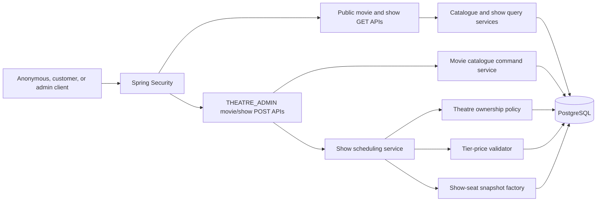
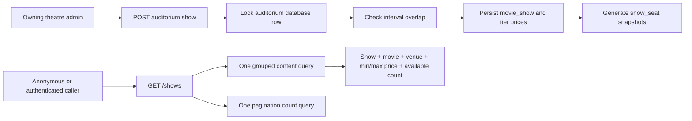
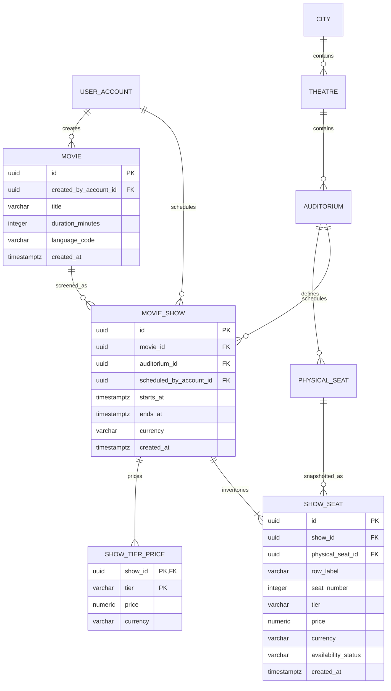
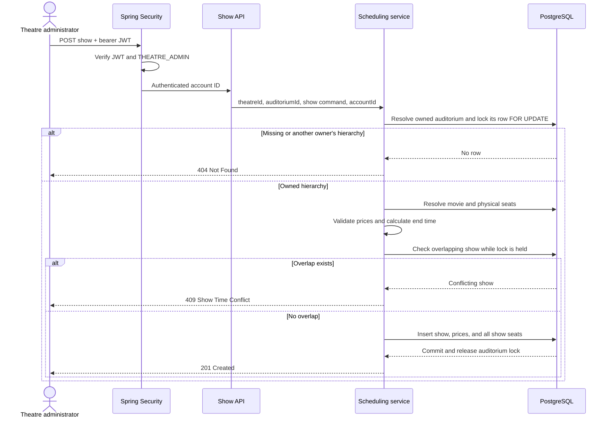
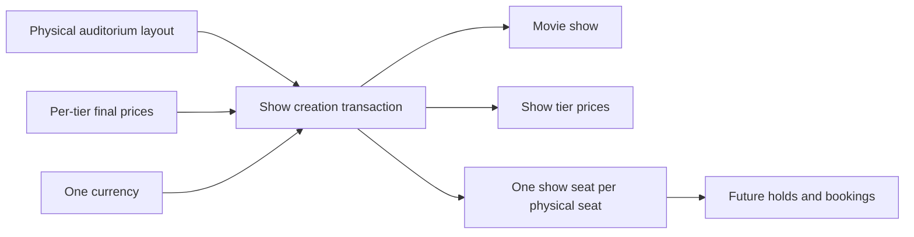

# Movie Catalogue and Show Scheduling Design Proposal

**Status:** Implemented  
**Last updated:** 2026-09-25  
**Depends on:** [Identity and Authentication Design](identity-authentication-design.md) and [Theatre Administration Design](theatre-admin-management-design.md)

## 1. Purpose

This document defines the implemented movie-catalogue, show-scheduling, show-discovery, and show-seat availability flow.

The design keeps two concerns separate:

- A global movie catalogue that theatre administrators can extend and everyone can read.
- Shows that a theatre administrator may schedule only inside a theatre they own.

Every show receives immutable, show-specific seat inventory copied from its auditorium's physical seats. Future holds and bookings will target that show inventory, never the physical layout.

## 2. Confirmed Requirements

- An authenticated account with role `THEATRE_ADMIN` can add a movie to the global catalogue.
- Customers and unauthenticated users can search and view movies.
- Movie data remains minimal; ratings, cast, reviews, and other rich editorial data are excluded.
- A theatre administrator can schedule a movie only in an auditorium belonging to a theatre they own.
- Ownership is verified by business logic using the authenticated JWT account ID.
- Every show has final prices for each physical seat tier used by the auditorium and one currency.
- There is no dynamic pricing engine.
- Weekend pricing is controlled by the theatre administrator supplying final prices separately for each show.
- Creating a show generates show-specific seat inventory from the auditorium's current physical seats.
- Each show seat retains the physical seat reference internally and snapshots row label, seat number, tier, price, and currency.
- `seatLabel` is never persisted; public responses derive it from the snapshotted row label and seat number.
- Public APIs expose `showSeatId`, not `physicalSeatId`.
- Holds and bookings will operate on show seats, not physical seats.
- Public APIs support movie search, movie detail, show search by city/movie/date, show detail, and show-seat availability.
- Timestamps are stored in UTC and application time comes from an injected UTC `Clock`.
- Show creation accepts only future start times, and show search returns only upcoming shows.
- Concurrent scheduling in one auditorium is serialized by locking that auditorium's database row inside the transaction.
- Hold, booking, payment, cancellation, and refund behavior is not designed in this phase.

## 3. Terminology

| Term | Meaning |
|---|---|
| Movie | A globally visible catalogue entry that can be scheduled by any theatre administrator. |
| Physical seat | The reusable seat definition belonging to an auditorium. It has no show price or booking state. |
| Show | One screening of one movie in one auditorium at a specific time. |
| Tier price | The final price assigned to one physical seat tier for one show. |
| Show seat | A show-specific, sellable seat snapshot created from a physical seat. |
| Availability | The current read model for whether a show seat is available. This phase only creates `AVAILABLE` seats. |
| Owner | The authenticated account referenced by `theatre.owner_account_id`. |

## 4. Scope

### 4.1 In scope

- Minimal movie creation by `THEATRE_ADMIN`.
- Public movie search and movie detail.
- Owner-checked show creation in an auditorium.
- Per-show, per-tier final pricing with one ISO 4217 currency.
- Atomic show, tier-price, and show-seat creation.
- Auditorium schedule-overlap prevention using a transactional database-row lock, including concurrent create requests.
- Public show search by city, movie, and local date.
- Public show detail.
- Public show-seat listing with current availability and snapshotted price.
- Flyway schema migrations.
- Spring Security route rules.

### 4.2 Out of scope

- Ratings, reviews, cast, crew, directors, studios, trailers, posters, images, awards, and recommendations.
- Synopsis, original release date, genres, tags, age certification, country metadata, and localized titles/descriptions.
- Movie update, deactivation, deletion, approval, or merge workflows.
- Show update, rescheduling, cancellation, deactivation, or deletion.
- A dynamic pricing, surge pricing, promotion, coupon, tax, or fee engine.
- Automatically detecting weekends or changing prices based on calendar rules.
- Prices on physical seats.
- Holds, hold expiry, booking, payment, cancellation, refund, and notification flows.
- Defining `HELD` or `BOOKED` state transitions.
- Customer-specific seat visibility or personalized pricing.
- Seat-map coordinates or graphical layout rendering.
- Multi-time-zone operation outside the current India-only city catalogue.

## 5. Core Design Decisions

### 5.1 Global movie catalogue

A movie is global rather than owned by the administrator who created it. `created_by_account_id` is retained for audit only. Any theatre administrator may schedule any movie in the catalogue, but only in their own theatre.

Movies become publicly searchable immediately after creation. This phase has no moderation or approval state.

The minimal movie fields are:

- Title
- Runtime in minutes
- Primary language code

Before persistence, the title is trimmed and repeated whitespace is collapsed. Duplicate detection uses the stored normalized title case-insensitively together with language and runtime. Because release date is deliberately absent, different cuts with different runtimes remain distinguishable; two genuinely different movies with the same normalized title, language, and runtime would conflict in this simplified catalogue and require a future richer identity model.

### 5.2 Resource URLs and authorization

URLs remain resource-oriented and contain no `/admin` prefix.

- Movie and show `GET` endpoints are public through Spring Security `permitAll` rules.
- Movie and show `POST` endpoints require a valid JWT and `THEATRE_ADMIN`.
- Show creation additionally performs resource-level ownership verification in the application/data-access layer.
- A theatre or auditorium outside the caller's ownership hierarchy is returned as `404`, consistent with the theatre-management API.

### 5.3 Final per-show pricing

The administrator supplies one final amount for every seat tier present in the auditorium when scheduling a show. One show uses one currency.

There is no pricing-rule evaluation. A weekend show is more expensive only when the administrator explicitly submits higher prices for that show. The server does not infer weekdays, weekends, holidays, demand, or promotions.

Java represents every monetary amount as `BigDecimal`. PostgreSQL persists each amount as `NUMERIC(12,2)` and stores its three-letter ISO 4217 currency alongside it. API amounts are JSON decimal numbers, such as `350.00`. Binary floating-point types are not used, and values with more than two fractional digits are rejected rather than rounded implicitly.

### 5.4 Exact tier-price coverage

The submitted tier-price set must exactly match the distinct tiers present among the auditorium's physical seats:

- Every used physical-seat tier has exactly one submitted price.
- No tier is duplicated.
- No price is accepted for a tier absent from the auditorium.
- Every amount is greater than zero.

With the current physical-seat model, the possible tiers are `REGULAR` and `PREMIUM`. An auditorium containing only `REGULAR` seats requires only a `REGULAR` price.

### 5.5 Show-seat snapshots

Show creation snapshots each physical seat into a new `show_seat` row. It stores:

- `physical_seat_id`
- Row label and seat number for stable ordering and response-label generation
- Tier
- Final decimal price
- Currency
- Initial availability status `AVAILABLE`

`seat_label` is not a database column. The API derives a label such as `A12` from the show seat's snapshotted `row_label` and `seat_number`.

Physical-seat data is the layout template only. Existing show seats never re-read their row, number, tier, or price from the physical seat after creation. Future physical-layout changes will affect future shows only.

### 5.6 Show-seat identity is the sales boundary

Every future hold or booking must reference `show_seat.id`. It must not reference `physical_seat.id` as the item being held or sold. Public APIs therefore expose `showSeatId` and do not expose the internal physical-seat reference.

The physical seat ID remains on the snapshot for traceability and uniqueness within a show. It does not carry availability or booking state across shows.

### 5.7 Transactional show creation

Show creation is one transaction:

1. Verify the caller has role `THEATRE_ADMIN`.
2. Resolve and pessimistically lock the `auditorium` database row through the theatre owned by the authenticated account.
3. Keep that auditorium row lock until the transaction commits or rolls back.
4. Resolve the movie.
5. Read the complete physical-seat layout and reject an empty auditorium.
6. Validate exact tier-price coverage and currency.
7. Calculate show end time from movie runtime.
8. While holding the row lock, query for an overlapping show and reject a conflict.
9. Insert the show tier prices.
10. Insert every show-seat snapshot with its final price.
11. Commit everything together.

Any failure rolls back the show, prices, and all show seats.

### 5.8 Schedule overlap

Shows in one auditorium must not overlap. A show occupies the half-open interval `[startsAt, endsAt)`, where:

`endsAt = startsAt + movie.durationMinutes`

Back-to-back shows are allowed. Cleaning or turnaround time is not automatically added in this phase; the administrator must choose start times accordingly.

Every scheduling transaction first acquires a pessimistic write lock on the target auditorium row, then performs the overlap query and inserts while holding that lock. All show-creation code must follow this protocol.

Requests for the same auditorium serialize. Requests for different auditoriums lock different rows and can proceed concurrently, including at the same start time. No JVM-local lock, PostgreSQL exclusion constraint, advisory lock, trigger, or vendor-specific range type is used.

### 5.9 Date and time

- API timestamps include an explicit offset and are normalized to UTC in responses.
- Show and audit timestamps are persisted as `TIMESTAMPTZ`; the application normalizes them to UTC before persistence.
- Services receive the existing injected UTC `Clock` and call `clock.instant()`. They do not call `Instant.now()` directly. Each use case captures its current instant once so all validations, filters, and generated audit timestamps in that operation use the same value.
- The `date` query parameter has no time zone, so customer-facing show search interprets it in `Asia/Kolkata` only when calculating its UTC start/end bounds.
- No local India timestamp is persisted.
- Show creation requires `startsAt` to be strictly later than `clock.instant()`.
- Every show-search query includes `starts_at > :requestNow`, where `requestNow` is captured from the injected clock, so only upcoming shows are returned.
- For the current Kolkata date, the lower bound is the later of the local day's UTC start and the current clock instant; already-started shows are excluded.
- A past local date returns an empty result. A future date uses the full converted UTC day interval.

If the platform expands beyond India, theatre-specific IANA time zones must be designed before scheduling those theatres.

### 5.10 Availability in this phase

Every generated show seat starts as `AVAILABLE`. The public seat API returns the stored status, but this phase exposes no operation that changes it.

The future hold/booking design will define additional states, transitions, expiry, locking, and read consistency. This document deliberately does not define them.

## 6. High-Level Design



### 6.1 Implemented module responsibilities

| Area | Responsibility |
|---|---|
| `movie.api` | Movie creation, public search, and detail HTTP contracts. |
| `movie.application` | Movie catalogue commands, queries, normalization, and duplicate handling. |
| `movie.domain` | Movie entity and repository. |
| `show.api` | Show creation, public search/detail, and show-seat availability contracts. |
| `show.application` | Ownership checks, scheduling, pricing validation, inventory snapshots, and public queries. |
| `show.domain` | Show, tier-price, and show-seat models and repositories. |
| `theatre.domain` | Existing theatre, auditorium, and physical-seat source data. |
| `security` | Public GET rules and `THEATRE_ADMIN` POST rules. |
| `shared.api` | Existing problem-response format. |

### 6.2 Implemented movie-show flow

The public resource name, Java model, and database name intentionally differ only where needed to avoid the awkward SQL identifier `show`:

| Layer | Implemented name |
|---|---|
| Public API | `/api/v1/shows` |
| Java entity | `MovieShow` |
| PostgreSQL table | `movie_show` |



Show creation runs in one transaction covering ownership resolution, auditorium-row locking, overlap validation, `movie_show` and tier-price persistence, and show-seat snapshot generation. Public show search returns a scalar projection from one grouped content query rather than loading a page of entities and issuing price/count queries for every show.

## 7. Domain Model



### 7.1 `movie`

| Column | Type | Rules |
|---|---|---|
| `id` | `UUID` | Primary key. |
| `created_by_account_id` | `UUID` | Required FK to `user_account(id)`; audit only, not ownership. |
| `title` | `VARCHAR(200)` | Required; trimmed with repeated whitespace collapsed. |
| `duration_minutes` | `INTEGER` | Required; 1–600. |
| `language_code` | `VARCHAR(10)` | Required; normalized lowercase language code. |
| `created_at` | `TIMESTAMPTZ` | Required, UTC. |

With the smaller model, the implemented duplicate key is case-insensitive `(title, language_code, duration_minutes)`. This prevents accidental duplicate submissions while still allowing a same-title movie in another language or with a different cut/runtime. A concurrent duplicate returns `409 MOVIE_ALREADY_EXISTS`.

### 7.2 `movie_show`

`show` can be awkward in SQL and framework naming, so the table is named `movie_show` while the API resource remains `/shows`.

| Column | Type | Rules |
|---|---|---|
| `id` | `UUID` | Primary key. |
| `movie_id` | `UUID` | Required FK to `movie(id)`. |
| `auditorium_id` | `UUID` | Required FK to `auditorium(id)`. |
| `scheduled_by_account_id` | `UUID` | Required FK to `user_account(id)`; audit record of the owning admin who scheduled it. |
| `starts_at` | `TIMESTAMPTZ` | Required; must be in the future when created. |
| `ends_at` | `TIMESTAMPTZ` | Required; calculated from runtime and later than `starts_at`. |
| `currency` | `VARCHAR(3)` | Required uppercase ISO 4217 code. |
| `created_at` | `TIMESTAMPTZ` | Required, UTC. |

Overlap is enforced by the auditorium-row locking protocol described in the concurrency section, not by a database exclusion constraint.

### 7.3 `show_tier_price`

| Column | Type | Rules |
|---|---|---|
| `show_id` | `UUID` | Required FK to `movie_show(id)`; part of composite PK. |
| `tier` | `VARCHAR(20)` | Required; part of composite PK. |
| `price` | `NUMERIC(12,2)` | Required and greater than zero; mapped to Java `BigDecimal`. |
| `currency` | `VARCHAR(3)` | Required uppercase ISO 4217 code; must match the show currency. |

Currency is stored on `movie_show`, each tier price, and each `show_seat`. The deliberate copies make tier-price and show-seat records complete monetary snapshots; application validation ensures they match the show's single currency.

### 7.4 `show_seat`

| Column | Type | Rules |
|---|---|---|
| `id` | `UUID` | Primary key and future hold/booking target. |
| `show_id` | `UUID` | Required FK to `movie_show(id)`. |
| `physical_seat_id` | `UUID` | Required FK to `physical_seat(id)`; traceability only after snapshot. |
| `row_label` | `VARCHAR(10)` | Required snapshot. |
| `seat_number` | `INTEGER` | Required snapshot. |
| `tier` | `VARCHAR(20)` | Required snapshot. |
| `price` | `NUMERIC(12,2)` | Required final price snapshot, greater than zero; mapped to Java `BigDecimal`. |
| `currency` | `VARCHAR(3)` | Required currency snapshot. |
| `availability_status` | `VARCHAR(20)` | Required; only `AVAILABLE` is created in this phase. |
| `created_at` | `TIMESTAMPTZ` | Required, UTC. |

Required uniqueness:

- `(show_id, physical_seat_id)`
- `(show_id, row_label, seat_number)`

There is no persisted `seat_label`; it is generated in responses. No hold ID, booking ID, expiry, or customer ID is added in this phase.

## 8. High-Level API Summary

| Access | Method | Path | Purpose |
|---|---|---|---|
| `THEATRE_ADMIN` | `POST` | `/api/v1/movies` | Add a movie to the global catalogue. |
| Public | `GET` | `/api/v1/movies` | Search movies. |
| Public | `GET` | `/api/v1/movies/{movieId}` | View one movie. |
| `THEATRE_ADMIN` + owner | `POST` | `/api/v1/theatres/{theatreId}/auditoriums/{auditoriumId}/shows` | Schedule a show and generate its inventory. |
| Public | `GET` | `/api/v1/shows` | Search shows by city, movie, and date. |
| Public | `GET` | `/api/v1/shows/{showId}` | View a show. |
| Public | `GET` | `/api/v1/shows/{showId}/seats` | View show seats and current availability. |

There are no movie or show `PUT`, `PATCH`, or `DELETE` APIs in this phase.

## 9. Movie API Contracts

### 9.1 Add a movie

`POST /api/v1/movies`

Requires `THEATRE_ADMIN`.

Request:

```json
{
  "title": "The Last Signal",
  "durationMinutes": 128,
  "languageCode": "hi"
}
```

Response — `201 Created`:

```json
{
  "id": "2baed1c9-97d7-423b-9e46-9869acc07601",
  "title": "The Last Signal",
  "durationMinutes": 128,
  "languageCode": "hi",
  "createdAt": "2026-09-25T09:00:00Z"
}
```

The creator account ID is taken from the JWT and is not exposed as movie ownership.

### 9.2 Search movies

`GET /api/v1/movies?q=signal&languageCode=hi&page=0&size=20`

Authentication is optional. `q` performs a case-insensitive title match. `languageCode` is optional. Results are ordered by normalized title ascending, language code ascending, duration ascending, then ID.

Response — `200 OK`:

```json
{
  "items": [
    {
      "id": "2baed1c9-97d7-423b-9e46-9869acc07601",
      "title": "The Last Signal",
      "durationMinutes": 128,
      "languageCode": "hi"
    }
  ],
  "page": 0,
  "size": 20,
  "totalElements": 1,
  "totalPages": 1
}
```

An empty or omitted `q` lists movies using the same ordering and pagination.

### 9.3 View a movie

`GET /api/v1/movies/{movieId}`

Authentication is optional. The response uses the full movie representation shown by the create endpoint.

Unknown ID: `404 MOVIE_NOT_FOUND`.

## 10. Show Scheduling API Contract

### 10.1 Create a show

`POST /api/v1/theatres/{theatreId}/auditoriums/{auditoriumId}/shows`

Requires `THEATRE_ADMIN` and ownership of the complete theatre/auditorium path.

Request:

```json
{
  "movieId": "2baed1c9-97d7-423b-9e46-9869acc07601",
  "startsAt": "2026-10-03T18:30:00+05:30",
  "currency": "INR",
  "tierPrices": [
    {
      "tier": "REGULAR",
      "amount": 250.00
    },
    {
      "tier": "PREMIUM",
      "amount": 400.00
    }
  ]
}
```

Response — `201 Created`:

```json
{
  "id": "3c2ae97f-daa9-46f6-a0f9-04610f930d90",
  "movie": {
    "id": "2baed1c9-97d7-423b-9e46-9869acc07601",
    "title": "The Last Signal",
    "durationMinutes": 128,
    "languageCode": "hi"
  },
  "theatre": {
    "id": "7ef3d58a-2ec9-4ca2-89ac-736ec9de8aa1",
    "name": "Central Cinema"
  },
  "auditorium": {
    "id": "dd31f63f-2351-453e-bc3a-dc1f4c2e890d",
    "name": "Screen 1"
  },
  "startsAt": "2026-10-03T13:00:00Z",
  "endsAt": "2026-10-03T15:08:00Z",
  "currency": "INR",
  "tierPrices": [
    {
      "tier": "REGULAR",
      "amount": 250.00
    },
    {
      "tier": "PREMIUM",
      "amount": 400.00
    }
  ],
  "totalSeatCount": 120,
  "availableSeatCount": 120,
  "createdAt": "2026-09-25T09:10:00Z"
}
```

The response and public APIs return normalized UTC timestamps. Clients can format them in `Asia/Kolkata` for display.

## 11. Public Show API Contracts

### 11.1 Search by city, movie, and date

`GET /api/v1/shows?cityId=7&movieId=2baed1c9-97d7-423b-9e46-9869acc07601&date=2026-10-03&page=0&size=20`

`cityId`, `movieId`, and `date` are required. Authentication is optional.

The date selects upcoming shows whose `startsAt` falls within that calendar date in `Asia/Kolkata`. The service converts the local half-open interval `[date at 00:00, next date at 00:00)` to UTC and applies `startsAt > :requestNow`, where `requestNow` is captured once from the injected clock. A past date therefore returns an empty page, and a search for the current Kolkata date excludes shows that have already started. Results are ordered by start time, theatre name, auditorium name, then show ID.

Response — `200 OK`:

```json
{
  "items": [
    {
      "id": "3c2ae97f-daa9-46f6-a0f9-04610f930d90",
      "movie": {
        "id": "2baed1c9-97d7-423b-9e46-9869acc07601",
        "title": "The Last Signal",
        "durationMinutes": 128,
        "languageCode": "hi"
      },
      "theatre": {
        "id": "7ef3d58a-2ec9-4ca2-89ac-736ec9de8aa1",
        "name": "Central Cinema"
      },
      "auditorium": {
        "id": "dd31f63f-2351-453e-bc3a-dc1f4c2e890d",
        "name": "Screen 1"
      },
      "startsAt": "2026-10-03T13:00:00Z",
      "endsAt": "2026-10-03T15:08:00Z",
      "currency": "INR",
      "minimumPrice": 250.00,
      "maximumPrice": 400.00,
      "availableSeatCount": 120
    }
  ],
  "page": 0,
  "size": 20,
  "totalElements": 1,
  "totalPages": 1
}
```

Unknown city or movie IDs return `404`; a valid search with no scheduled shows returns an empty `200` page.

### 11.2 View a show

`GET /api/v1/shows/{showId}`

Authentication is optional.

The response uses the full show representation from show creation and includes current `availableSeatCount`. Unknown ID returns `404 SHOW_NOT_FOUND`.

### 11.3 View show seats and current availability

`GET /api/v1/shows/{showId}/seats`

Authentication is optional. Results are ordered by snapshotted row label, seat number, then show-seat ID.

Response — `200 OK`:

```json
{
  "showId": "3c2ae97f-daa9-46f6-a0f9-04610f930d90",
  "currency": "INR",
  "items": [
    {
      "showSeatId": "51b34ec6-f92c-461d-81e1-54b3840471c5",
      "rowLabel": "A",
      "seatNumber": 1,
      "seatLabel": "A1",
      "tier": "REGULAR",
      "price": {
        "amount": 250.00,
        "currency": "INR"
      },
      "availability": "AVAILABLE"
    }
  ]
}
```

The API exposes `showSeatId` as the only seat identity a future hold/booking API will accept. The internal physical-seat reference is not exposed by any public API. `seatLabel` is generated from the snapshotted `rowLabel` and `seatNumber`; it is not persisted. No hold or booking endpoint is defined here.

## 12. Validation Rules

| Resource | Rule |
|---|---|
| Movie | Title is trimmed, repeated whitespace is collapsed, and the normalized result contains 1–200 characters. |
| Movie | Runtime is 1–600 minutes. |
| Movie | Language code is normalized lowercase and contains 2–10 permitted language-tag characters. |
| Movie | Case-insensitive title/language plus runtime tuple is unique. |
| Show | Movie exists. |
| Show | Theatre exists and is owned by the authenticated administrator. |
| Show | Auditorium exists under the path theatre. |
| Show | Auditorium contains at least one physical seat. |
| Show | Start timestamp includes an offset and is strictly later than the injected UTC clock's current instant. |
| Show | Calculated time range does not overlap another show in the auditorium. |
| Pricing | Currency is a supported uppercase ISO 4217 code. |
| Pricing | Tier set exactly equals the distinct physical-seat tier set. |
| Pricing | Every amount is a positive Java `BigDecimal`, has at most two fractional digits, and fits PostgreSQL `NUMERIC(12,2)`. |
| Inventory | Generated show-seat count exactly equals physical-seat count. |
| Inventory | Every physical seat appears once in the show. |

## 13. Ownership Enforcement

The authenticated admin account ID comes only from the verified JWT `sub` claim. Neither `ownerAccountId` nor `scheduledByAccountId` is accepted in request JSON.

The scheduling use case resolves the hierarchy with an owner-scoped lookup equivalent to:

`auditorium.id = :auditoriumId AND auditorium.theatre.id = :theatreId AND theatre.ownerAccountId = :authenticatedAccountId`

Movie authorship does not confer scheduling rights. Ownership of the destination theatre is the only resource-level authorization rule for show creation.



## 14. Show Inventory Generation

For each physical seat, show creation performs this mapping:

| Physical/show input | Show-seat snapshot |
|---|---|
| `physical_seat.id` | Internal `physical_seat_id`; never returned by public APIs |
| `physical_seat.row_label` | `row_label` |
| `physical_seat.seat_number` | `seat_number` |
| Derived `rowLabel + seatNumber` | Response-only `seatLabel`; no database column |
| `physical_seat.tier` | `tier` |
| Submitted `BigDecimal` price for that tier | `price NUMERIC(12,2)` |
| Submitted show currency | `currency` |
| Constant at creation | `availability_status = AVAILABLE` |



The arrow to future holds/bookings establishes identity ownership only; no hold or booking behavior is defined in this design.

## 15. Schedule Concurrency

The scheduling transaction uses the auditorium row as the concurrency boundary. The row exists even when an auditorium has no scheduled shows, which gives every scheduling request a stable record to lock before checking for overlap.

The required protocol is:

1. Begin the transaction.
2. Resolve the auditorium through its owned theatre and acquire a pessimistic write lock on that auditorium row, equivalent to `SELECT ... FOR UPDATE`.
3. Resolve the movie, capture the current instant from the injected UTC clock, revalidate that the requested start is still in the future, and calculate the requested half-open interval `[requestedStart, requestedEnd)`.
4. While still holding the auditorium lock, query that auditorium for an existing show where `existing.starts_at < requestedEnd AND existing.ends_at > requestedStart`.
5. If an overlap exists, roll back and return `409 SHOW_TIME_CONFLICT`.
6. Otherwise insert the show, tier prices, and show-seat snapshots, then commit. The database releases the auditorium lock at transaction completion.

```mermaid
sequenceDiagram
    participant A as Request A
    participant DB as PostgreSQL
    participant B as Request B
    A->>DB: Lock auditorium X row
    DB-->>A: Lock acquired
    B->>DB: Lock auditorium X row
    Note over B,DB: Waits for X
    A->>DB: Check overlap and insert show
    A->>DB: Commit; release X
    DB-->>B: Lock acquired
    B->>DB: Check overlap against committed show
    DB-->>B: Conflict; roll back
```

Every path that creates a show must follow this protocol. Concurrent requests for the same auditorium serialize, so two overlapping requests cannot both pass the check. Requests for different auditoriums lock different rows and may proceed concurrently, even at identical times.

This design does not use a local Java lock, a PostgreSQL exclusion constraint, an advisory lock, a trigger, or a database-specific range type. Transaction boundaries must cover the lock, overlap query, and all inserts.

## 16. Query Strategy and Indexes

Implemented supporting indexes:

- Case-insensitive movie duplicate index on `(lower(title), lower(language_code), duration_minutes)`.
- Movie search index suitable for case-insensitive title matching. A basic functional index is preferred initially; full-text search is out of scope.
- `movie_show(movie_id, starts_at, id)` for movie/date searches.
- `movie_show(auditorium_id, starts_at, ends_at)` for overlap checks while the auditorium row is locked.
- `show_seat(show_id, row_label, seat_number, id)` for ordered seat listing.
- `show_seat(show_id, availability_status)` for availability counts.
- Unique show-seat snapshot keys listed in the schema section.

Show search joins `movie_show -> movie`, `movie_show -> auditorium -> theatre -> city`, and `movie_show -> show_seat`. It filters by city, movie, calculated UTC date bounds, and `starts_at > :requestNow`, groups by the show/display fields, and calculates minimum price, maximum price, and available-seat count in the same content query. Spring Data executes at most one additional count query when pagination needs it; it does not issue price or availability queries per returned show. The model does not duplicate `city_id` or `theatre_id` on `movie_show`.

## 17. Error Contract

The feature reuses the existing `application/problem+json` shape.

```json
{
  "type": "urn:movie-ticketing:problem:show-time-conflict",
  "title": "Show time conflict",
  "status": 409,
  "detail": "The auditorium already has a show during the requested time.",
  "instance": "/api/v1/theatres/7ef3d58a-2ec9-4ca2-89ac-736ec9de8aa1/auditoriums/dd31f63f-2351-453e-bc3a-dc1f4c2e890d/shows",
  "code": "SHOW_TIME_CONFLICT",
  "violations": []
}
```

| HTTP status | Code | When |
|---:|---|---|
| 400 | `MALFORMED_REQUEST` | The JSON request body cannot be parsed. |
| 400 | `VALIDATION_FAILED` | Body validation fails, a required query parameter is missing, a query parameter has the wrong type, or movie/schedule/currency/price/pagination input is invalid. |
| 400 | `TIER_PRICE_MISMATCH` | Submitted tiers do not exactly cover the auditorium tiers. |
| 401 | `INVALID_TOKEN` / `TOKEN_EXPIRED` | Protected request lacks a valid JWT. |
| 403 | `FORBIDDEN` | Account lacks `THEATRE_ADMIN` for a command. |
| 404 | `MOVIE_NOT_FOUND` | Movie does not exist. |
| 404 | `CITY_NOT_FOUND` | Show-search city does not exist. |
| 404 | `THEATRE_NOT_FOUND` | Scheduling theatre is missing or not owned by the caller. |
| 404 | `AUDITORIUM_NOT_FOUND` | Auditorium is missing or outside the owned path. |
| 404 | `SHOW_NOT_FOUND` | Show does not exist. |
| 409 | `MOVIE_ALREADY_EXISTS` | Duplicate movie catalogue key. |
| 409 | `AUDITORIUM_HAS_NO_SEATS` | A show cannot be created without a physical layout. |
| 409 | `SHOW_TIME_CONFLICT` | Requested interval overlaps another show. |

## 18. Flyway Migration Implementation

The implementation adds the append-only `V4__create_movie_catalogue_and_show_schema.sql` migration after the theatre migrations:

1. Create `movie`, `movie_show`, `show_tier_price`, and `show_seat` with portable constraints and indexes. It does not add a database extension, exclusion constraint, advisory-lock function, or range type.
2. Do not seed movies, shows, prices, or show seats.

Hibernate continues using `ddl-auto: validate`; Flyway remains the schema owner.

## 19. Security Considerations

- Permit anonymous `GET` access only to the documented movie/show read routes.
- Require `THEATRE_ADMIN` for movie and show `POST` routes.
- Never accept account ID, theatre owner ID, or availability state from the client.
- Enforce scheduling ownership in the database-scoped business query, not only in a controller.
- Treat cross-owner paths as not found.
- Validate pagination and search bounds to prevent unbounded reads.
- Limit title and other text lengths.
- Use Java `BigDecimal`, PostgreSQL `NUMERIC(12,2)`, and strict currency validation; never use binary floating-point monetary types.
- Do not expose internal physical-seat IDs through public show APIs.
- Return only show-seat availability data; no future customer, hold, or booking identifiers exist yet.

## 20. Test Strategy

### 20.1 Movie catalogue

- Anonymous and `CUSTOMER` callers can search and view movies.
- Anonymous and `CUSTOMER` callers cannot create movies.
- `THEATRE_ADMIN` can create a valid movie.
- Duplicate title/language/runtime creation returns one success and one conflict under concurrency.
- Search is case-insensitive, filtered, ordered, and paginated as documented.

### 20.2 Ownership and scheduling

- Admin A can schedule in A's theatre/auditorium.
- Admin A cannot schedule in Admin B's hierarchy.
- A mismatched theatre/auditorium path returns `404`.
- Any admin can schedule a movie created by another admin in their own theatre.
- Unknown movie and empty-auditorium requests create no show.

### 20.3 Pricing

- Exact price coverage succeeds for one-tier and two-tier auditoriums.
- Missing, duplicate, and extra tier prices fail atomically.
- `BigDecimal` values round-trip through `NUMERIC(12,2)` without binary floating-point conversion.
- Invalid currency, precision, scale greater than two, zero, and negative prices are rejected without implicit rounding.
- Different shows for the same auditorium may use different prices, including weekend shows.
- Physical-seat rows never acquire price columns.

### 20.4 Inventory snapshots

- Generated show-seat count equals physical-seat count.
- Every physical seat maps exactly once.
- Row labels, seat numbers, tiers, prices, and currency match their creation snapshots.
- `seatLabel` is derived in responses and no `seat_label` column is persisted.
- Public responses contain `showSeatId` and never expose `physicalSeatId`.
- Every new show seat is `AVAILABLE`.
- Failure during any generated insert rolls back the complete show.

### 20.5 Scheduling concurrency

- Non-overlapping shows in one auditorium succeed.
- Back-to-back intervals succeed.
- Overlapping intervals fail.
- The scheduling transaction acquires a pessimistic write lock on the target auditorium row before its overlap query.
- Two concurrent overlapping requests for one auditorium result in at most one committed show and one complete seat inventory.
- Shows at the same time in different auditoriums both succeed because they lock different rows.
- No local Java lock or PostgreSQL exclusion, advisory-lock, or range-type mechanism is used.

### 20.6 Public discovery

- Anonymous and `CUSTOMER` callers can search shows and view show details/seats.
- Date boundaries use `Asia/Kolkata`, including conversion to UTC.
- A deterministic injected UTC `Clock` drives future-start validation and upcoming-show filtering.
- A current-date search excludes already-started shows, a past-date search is empty, and a future-date search uses the complete converted local day.
- Search filters by the requested city and movie.
- Empty valid searches return an empty page.
- Availability count matches current show-seat status counts.
- A search page obtains its minimum price, maximum price, and available-seat count through one aggregate content query, with no per-show price/count queries.
- Malformed JSON, missing required query parameters, and invalid query-parameter types use the shared problem response envelope and stable error codes.

### 20.7 Integration testing

- Use PostgreSQL Testcontainers so row-lock behavior, transactions, Flyway migrations, ownership joins, timestamps, and decimal price constraints run on the real database engine.
- Cover admin signup/sign-in, movie creation, owned theatre setup, show creation, public discovery, and show-seat listing end to end.

## 21. Acceptance Criteria

The implementation satisfies the following acceptance criteria:

- A theatre administrator can create a minimal global movie entry.
- Movie search and detail are public.
- Only an owning theatre administrator can schedule a show in a theatre/auditorium path.
- Show creation validates exact per-tier final prices and one currency.
- Weekend prices remain explicit per-show inputs with no dynamic pricing engine.
- Monetary values use Java `BigDecimal` and PostgreSQL `NUMERIC(12,2)`, with currency stored alongside them.
- Show creation uses an auditorium-row lock so concurrent overlapping shows in one auditorium cannot both commit while different auditoriums remain independent.
- Show creation atomically generates one complete show-seat snapshot per physical seat.
- All timestamps are stored in UTC and application time is obtained from an injected UTC `Clock`.
- Show creation accepts only future start times.
- Show search by city, movie, and India-local date is public and returns only upcoming shows.
- Show detail and show-seat availability are public.
- Show seats internally retain physical-seat identity and snapshot row label, seat number, tier, final price, currency, and availability.
- Public seat responses expose `showSeatId`, never `physicalSeatId`, and derive `seatLabel` from the snapshot fields.
- No hold or booking behavior is introduced.
- README, API documentation, automated tests, and the Postman collection are updated.

## 22. Implemented Decisions

The implementation follows these confirmed decisions:

1. A movie is global and immediately public; its creator is audit metadata, not an owner.
2. Minimal movie fields are title, runtime, and primary language code.
3. Duplicate movies are identified by case-insensitive title, language code, and runtime. Different runtimes are treated as different cuts.
4. `cityId`, `movieId`, and `date` are all required for show search.
5. `Asia/Kolkata` is used only to interpret customer-supplied search dates; all timestamps are stored and returned in UTC.
6. Back-to-back shows are allowed with no automatic cleaning buffer.
7. Each show uses one ISO 4217 currency. API amounts are JSON decimal numbers represented by Java `BigDecimal` and persisted as `NUMERIC(12,2)`.
8. Submitted prices exactly cover tiers present in the auditorium; unused tier prices are rejected.
9. Show-seat status starts as `AVAILABLE`; future hold/booking states and transitions remain undesigned.
10. Movie/show update, cancellation, and deletion APIs remain outside this phase.
11. An auditorium database-row lock plus an overlap query is the only show-scheduling concurrency protocol; no JVM-local or PostgreSQL-specific locking feature is added.

Hold and booking design remains the next separate phase; it is not implemented here.
