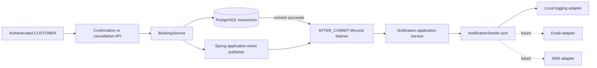
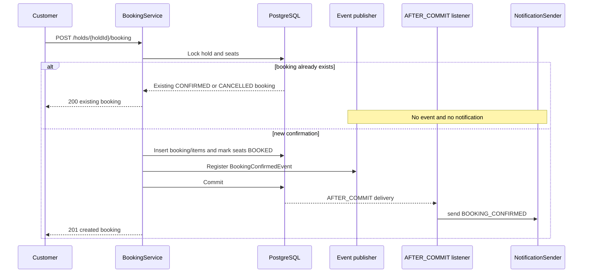
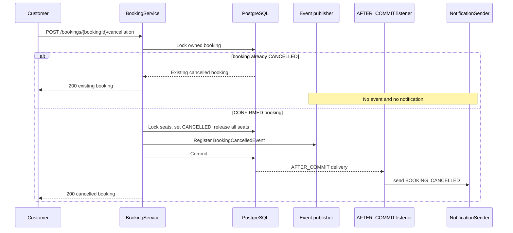

# Booking Lifecycle Notification Design

Status: **Implemented**

This document describes the implemented, pluggable notification flow for booking confirmation and booking cancellation. The current adapter records structured application logs. Future email, SMS, or other delivery providers can implement the same application port without changing booking state-transition logic.

## 1. Confirmed Requirements

- A customer notification is triggered when a booking is newly confirmed.
- A customer notification is triggered when a booking is newly cancelled.
- Idempotent confirmation and cancellation retries must not trigger another notification.
- The implementation uses a local logging adapter; no external email or SMS provider is required.
- The delivery boundary must be replaceable so external providers can be added later.
- Notification failure must never roll back or otherwise undo a successful confirmation or cancellation.
- Existing booking APIs and responses remain unchanged.
- The flow is implemented in Java and configuration with automated tests. It requires no schema migration or new HTTP request.

For this local phase, “receive a notification” means a booking lifecycle message is accepted by the logging adapter and recorded in the application log. It does not yet mean that an email, SMS, or push message leaves the application.

The current model has no separate pending-booking step: the booking row is created directly as `CONFIRMED`. Therefore `BOOKING_CONFIRMED` represents both booking creation and confirmation. `BOOKING_CANCELLED` represents the later, separate cancellation transition.

## 2. Scope

### 2.1 In scope

- Produce one `BOOKING_CONFIRMED` event only when a booking is newly created as `CONFIRMED`.
- Produce one `BOOKING_CANCELLED` event only when a booking first transitions from `CONFIRMED` to `CANCELLED`.
- Dispatch both notification types only after their owning database transaction commits.
- Define one channel-neutral notification-sender port that accepts both message types.
- Provide a local adapter that writes structured, security-safe application logs.
- Isolate adapter failures from both booking operations and their HTTP responses.
- Define package boundaries, payloads, configuration, retry behavior, failure behavior, and tests.

### 2.2 Out of scope

- Real email, SMS, push, webhook, or in-app delivery.
- Durable notification storage, an outbox table, message broker, or queue.
- Automatic retries, dead-letter handling, replay, or administrative redelivery.
- Delivery receipts, sent/read status, or a customer notification inbox API.
- User notification preferences, opt-out rules, templates, localization, or channel selection.
- Phone-number collection or verification.
- Show-reminder, payment, refund, or promotional notifications.
- Guaranteed delivery across process crashes.

## 3. Delivery Semantics

The implemented version is **after-commit, best-effort delivery**:

- The committed booking state is the source of truth.
- The state-changing branch registers exactly one matching event inside the transaction.
- The local adapter runs only after that transaction commits.
- An adapter exception is caught and logged; it is not returned through the booking API.
- A failed or rolled-back confirmation/cancellation transaction produces no notification.
- A request that only replays an already completed confirmation or cancellation produces no event.
- If the application process stops after commit but before the listener runs, the notification may be lost.

The last point is an accepted limitation of the simple local implementation. Guaranteed delivery would require a later transactional-outbox or equivalent durable-messaging design.

## 4. High-Level Design



The `notification` package owns notification orchestration and delivery adapters. The `booking` package owns the facts that a booking became confirmed or cancelled. Notification consumes those facts; booking does not import a concrete notification adapter.

## 5. Package Boundaries

```text
booking/
|- application/
|  |- BookingService
|  |- BookingConfirmedEvent
|  `- BookingCancelledEvent
`- ...

notification/
|- application/
|  |- BookingNotificationListener
|  |- NotificationService
|  |- NotificationSender                 port
|  |- NotificationMessage                common message contract
|  |- BookingConfirmedNotification
|  `- BookingCancelledNotification
`- adapter/
   `- logging/
      `- LoggingNotificationSender       local adapter
```

Dependency direction:

```text
notification listener -> booking lifecycle events
notification service  -> notification sender port
logging adapter       -> notification sender port
booking service       -> Spring application-event abstraction
```

There is no `booking -> logging adapter` or `booking -> email/SMS SDK` dependency. Future adapters are selected through Spring configuration and implement the same `NotificationSender` port.

## 6. Event Contracts

### 6.1 Newly confirmed booking

The booking application emits an immutable `BookingConfirmedEvent` only on the branch that creates a new booking:

```java
record BookingConfirmedEvent(
        UUID bookingId,
        UUID customerAccountId,
        UUID showId,
        Instant confirmedAt,
        BigDecimal totalAmount,
        String currency,
        int seatCount
) {}
```

The event is not emitted when confirmation returns an existing booking with `created = false`, including when that existing booking has subsequently been cancelled.

### 6.2 Newly cancelled booking

The booking application emits an immutable `BookingCancelledEvent` only on the branch that performs `CONFIRMED -> CANCELLED` and releases the complete seat set:

```java
record BookingCancelledEvent(
        UUID bookingId,
        UUID customerAccountId,
        UUID showId,
        Instant confirmedAt,
        Instant cancelledAt,
        BigDecimal totalAmount,
        String currency,
        int seatCount
) {}
```

The event is not emitted when the cancellation endpoint locks a booking that is already `CANCELLED` and returns the existing representation.

`totalAmount` is the original booked amount. It does not represent a refund or credit, because financial reversal remains out of scope.

### 6.3 Shared event rules

- `BigDecimal` remains the Java money type.
- Currency remains the booking's three-letter ISO 4217 value.
- `confirmedAt` and `cancelledAt` reuse the UTC instants already stored on the booking; no direct `Instant.now()` call is introduced.
- `seatCount` comes from the complete immutable booking-item set.
- Events contain no password, JWT, email address, physical-seat ID, or internal current-owner pointer.
- `(event type, bookingId)` is the logical deduplication identity for a future durable/external provider.
- Events are carried through the in-process Spring event mechanism and are not persisted in this phase.

## 7. Channel-Neutral Notification Contract

### 7.1 Message types

The notification listener maps the booking events to channel-neutral messages:

```java
public interface NotificationMessage {
    NotificationType type();
    UUID bookingId();
    UUID customerAccountId();
    UUID showId();
    BigDecimal totalAmount();
    String currency();
    int seatCount();
}

public enum NotificationType {
    BOOKING_CONFIRMED,
    BOOKING_CANCELLED
}
```

`BookingConfirmedNotification` and `BookingCancelledNotification` implement this common contract and carry their respective type-safe lifecycle fields. The sender does not receive an untyped map.

The first version identifies the recipient by `customerAccountId`. Channel-specific address resolution is intentionally deferred:

- a future email adapter may resolve the account's verified email through an identity-facing port;
- a future SMS adapter requires a separately designed and verified phone-number model; and
- booking state transitions do not acquire these channel-specific dependencies.

### 7.2 Sender port

```java
public interface NotificationSender {
    void send(NotificationMessage notification);
}
```

The port reports technical delivery failure by throwing a runtime exception. `NotificationService` owns the policy of containing that failure so it cannot affect the already-committed booking transition.

This phase selects one active sender. Multi-channel fan-out and per-customer channel preferences require a later design.

## 8. Transaction Integration

### 8.1 Confirmation flow



The existing confirmation ordering remains unchanged:

1. Lock the owned hold.
2. If a booking already exists for the hold, return it and register no event.
3. Lock and validate the complete show-seat set.
4. Create the booking.
5. Create and flush every booking item.
6. Update and flush every show seat to `BOOKED`.
7. Register one `BookingConfirmedEvent` from the already-calculated booking data.
8. Commit the existing booking transaction.
9. Spring invokes the listener with `@TransactionalEventListener(phase = AFTER_COMMIT, fallbackExecution = false)`.

### 8.2 Cancellation flow



The existing cancellation ordering remains unchanged:

1. Lock the owner-scoped booking row.
2. If its status is already `CANCELLED`, return it and register no event.
3. Load the booking-item count and lock every show seat in stable UUID order.
4. Capture and validate `cancelledAt` and verify complete current seat ownership.
5. Change the booking to `CANCELLED` and release every seat to `AVAILABLE`.
6. Flush the booking and show-seat changes.
7. Register one `BookingCancelledEvent` from the stored booking and complete item set.
8. Commit the existing cancellation transaction.
9. Spring invokes the same notification boundary through `@TransactionalEventListener(phase = AFTER_COMMIT, fallbackExecution = false)`.

### 8.3 Failure isolation

No notification code starts a new transaction. The listener is synchronous in the first version, but delivery work occurs after the booking transaction commits. The local logging adapter is fast enough that a separate executor is unnecessary.

The notification boundary includes both event-to-message mapping and sender invocation in one `try/catch`. It catches provider and mapping `RuntimeException` failures, writes a failure log, and does not rethrow. It does not catch JVM `Error` conditions.

This prevents ordinary notification failures from rolling back either booking operation or replacing a successful `201`/`200` response with an error.

## 9. Idempotency and Concurrent Requests

| Operation result | Event | Notification |
|---|---|---|
| First successful confirmation creates booking | One `BookingConfirmedEvent` | One `BOOKING_CONFIRMED` attempt after commit |
| Confirmation retry returns existing `CONFIRMED` booking | None | None |
| Confirmation retry returns booking already `CANCELLED` | None | None |
| First successful cancellation changes state | One `BookingCancelledEvent` | One `BOOKING_CANCELLED` attempt after commit |
| Cancellation retry returns existing `CANCELLED` booking | None | None |
| Confirmation/cancellation transaction rolls back | Registered event is discarded | None |

Existing PostgreSQL row locking already serializes concurrent duplicate confirmation and cancellation requests. Exactly one request reaches each state-changing branch, so only that request registers the matching lifecycle event.

The best-effort implementation does not persist delivery keys, so it cannot guarantee cross-process exactly-once delivery. Future adapters should use `(notificationType, bookingId)` as their logical idempotency key when an external provider supports idempotency.

## 10. Local Logging Adapter

The local adapter writes one structured `INFO` record for a successful simulated delivery.

Common fields:

```text
event=booking_notification_sent
notificationType=BOOKING_CONFIRMED|BOOKING_CANCELLED
bookingId=<uuid>
customerAccountId=<uuid>
showId=<uuid>
totalAmount=<decimal>
currency=<iso-code>
seatCount=<number>
provider=local-log
```

Confirmation adds:

```text
confirmedAt=<utc-instant>
```

Cancellation adds:

```text
confirmedAt=<utc-instant>
cancelledAt=<utc-instant>
```

Failure fields:

```text
event=booking_notification_failed
notificationType=<type>
bookingId=<uuid>
provider=<configured-provider>
exceptionType=<safe exception class>
```

Logs must not contain passwords, JWTs, raw authorization headers, or unneeded customer contact data. Stack traces remain server-side and are never returned in booking API responses.

The local log is adapter output, not a durable notification audit record. Log retention and search depend on the runtime environment.

## 11. Configuration and Adapter Replacement

Implemented configuration:

```yaml
app:
  notifications:
    provider: logging
```

The application defaults `provider` to `logging`. `LoggingNotificationSender` is activated by a conditional property with `matchIfMissing = true`; an unsupported configured provider leaves no `NotificationSender` bean and fails startup rather than silently selecting another provider.

A future external adapter can be introduced by:

1. implementing `NotificationSender` for both supported message types;
2. adding provider-specific configuration and credentials outside source control;
3. conditionally selecting the implementation through `app.notifications.provider`; and
4. adding provider contract and failure tests.

No booking controller, HTTP contract, booking table, or show-seat rule changes when replacing the adapter.

## 12. API Contract

No new HTTP endpoint is introduced.

Existing contracts remain unchanged:

- `POST /api/v1/holds/{holdId}/booking` returns `201` for creation and `200` for a replay.
- `POST /api/v1/bookings/{bookingId}/cancellation` returns `200` for both the first state change and an idempotent replay.
- Notification success or failure adds no response field and changes no status code.

The API does not claim that an external channel delivered a message. In the local phase, a structured log represents successful adapter handling.

## 13. Database and Schema

No Flyway migration is required.

The initial implementation does not add:

- a notification or notification-attempt table;
- booking confirmation/cancellation notification status columns;
- an outbox table; or
- notification-delivery indexes.

If reliable delivery, retry, or customer-visible history becomes required, that capability must be designed as durable state rather than inferred from application logs.

## 14. Failure Matrix

| Failure | Booking state | Notification | Client response |
|---|---|---|---|
| Confirmation validation/write/commit fails | Not newly confirmed | Not attempted | Existing error response |
| Cancellation validation/write/commit fails | Remains `CONFIRMED` | Not attempted | Existing error response |
| Confirmation local adapter succeeds | Committed `CONFIRMED` | Structured success log | Existing `201` response |
| Cancellation local adapter succeeds | Committed `CANCELLED`; seats released | Structured success log | Existing `200` response |
| Either adapter call throws | Committed state remains unchanged | Failure log; no retry | Existing success response |
| Confirmation replay | Existing booking unchanged | Not attempted again | Existing `200` response |
| Cancellation replay | Existing `CANCELLED` booking unchanged | Not attempted again | Existing `200` response |
| Process stops after commit, before listener | Committed state remains | May be lost | Original response may be interrupted |

## 15. Testing Strategy

### 15.1 Booking application tests

- A newly created booking registers exactly one confirmation event with correct IDs, money, time, and seat count.
- An idempotent confirmation replay registers no event.
- A first `CONFIRMED -> CANCELLED` transition registers exactly one cancellation event with correct IDs, money, confirmation/cancellation times, and seat count.
- An idempotent cancellation replay registers no event.
- A confirmation replay after cancellation registers no event.
- Validation failures register no event.
- Existing persistence and lock ordering remain unchanged.

### 15.2 PostgreSQL transaction tests

- Each sender invocation happens only after its real PostgreSQL transaction commits.
- Forced confirmation and cancellation rollbacks never invoke the sender.
- Sender failure leaves a new booking and all `BOOKED` seats committed.
- Sender failure leaves a cancelled booking and all released seats committed.
- Sender failure does not change confirmation `201` or cancellation `200` responses.
- Two concurrent confirmations produce one confirmation notification attempt.
- Two concurrent cancellations produce one cancellation notification attempt.

### 15.3 Adapter tests

- The logging adapter accepts both notification message types and emits their expected structured fields.
- Sensitive token and password data are absent.
- `NotificationService` contains mapping and sender invocation in one boundary, catches delivery `RuntimeException` failures, and does not rethrow them.
- Configuration selects exactly one sender implementation and rejects unknown provider values.

## 16. Security and Privacy

- Events are created entirely from server-owned booking data.
- Clients cannot submit notification type, provider, recipient account, amount, lifecycle timestamps, or delivery status.
- The logging adapter does not log authentication credentials or authorization headers.
- Customer account ID is sufficient for the local adapter; adding email or phone destinations requires a channel-specific privacy review.
- External provider secrets must use environment or secret-management configuration and never be stored in the repository.

## 17. Operational Characteristics

- The local adapter adds negligible work after commit.
- Because the listener is synchronous, a slow future adapter would increase response latency even though it could not roll back the booking state.
- Before enabling a network provider, revisit timeouts, retry ownership, circuit breaking, asynchronous execution, and durable delivery.
- Notification logs provide development visibility but are not a substitute for delivery metrics or an audit store.

## 18. Implementation Decisions

The implementation follows these approved decisions:

1. Emit `BookingConfirmedEvent` only when a booking is newly created as `CONFIRMED`.
2. Emit `BookingCancelledEvent` only for the first `CONFIRMED -> CANCELLED` transition.
3. Emit nothing for confirmation or cancellation replays, including confirmation replay after cancellation.
4. Consume both events through synchronous `@TransactionalEventListener(phase = AFTER_COMMIT, fallbackExecution = false)` methods.
5. Catch ordinary mapping and adapter `RuntimeException` failures inside the notification boundary so committed state and successful responses are preserved; do not catch JVM `Error` conditions.
6. Define one `NotificationSender` over a common, type-safe `NotificationMessage` contract and use a local structured-logging adapter first.
7. Select one active adapter through `app.notifications.provider=logging`.
8. Add no database table, outbox, queue, retry, delivery status, or new API in this phase.
9. Treat delivery as best effort and document that a process crash can lose either notification type.

Real external delivery, durability, and retry remain deferred to a later design.
