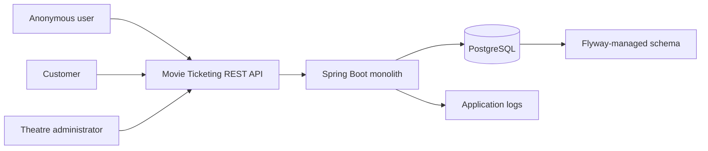
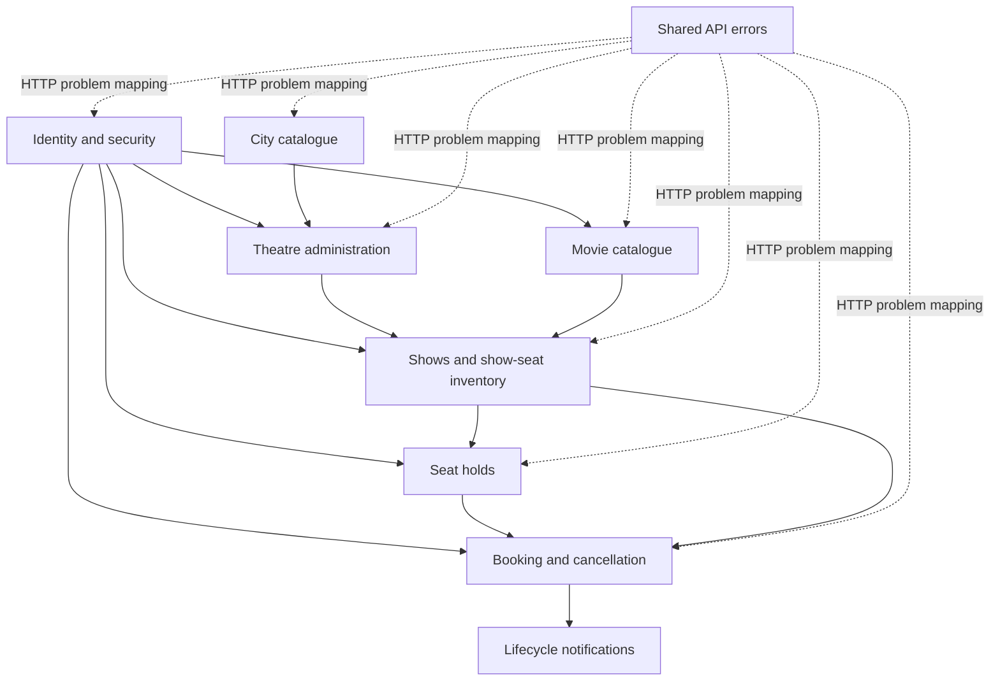
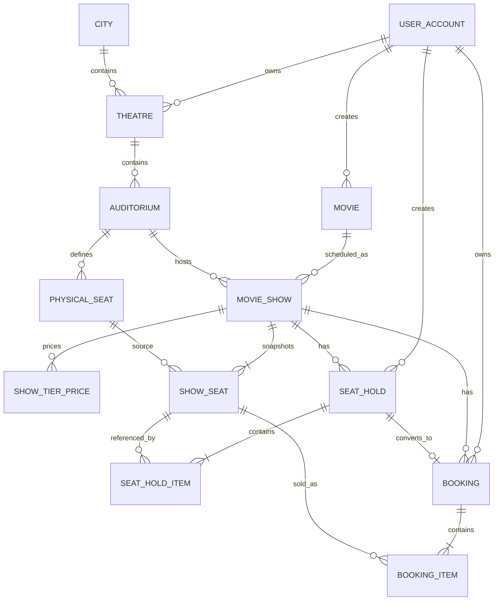
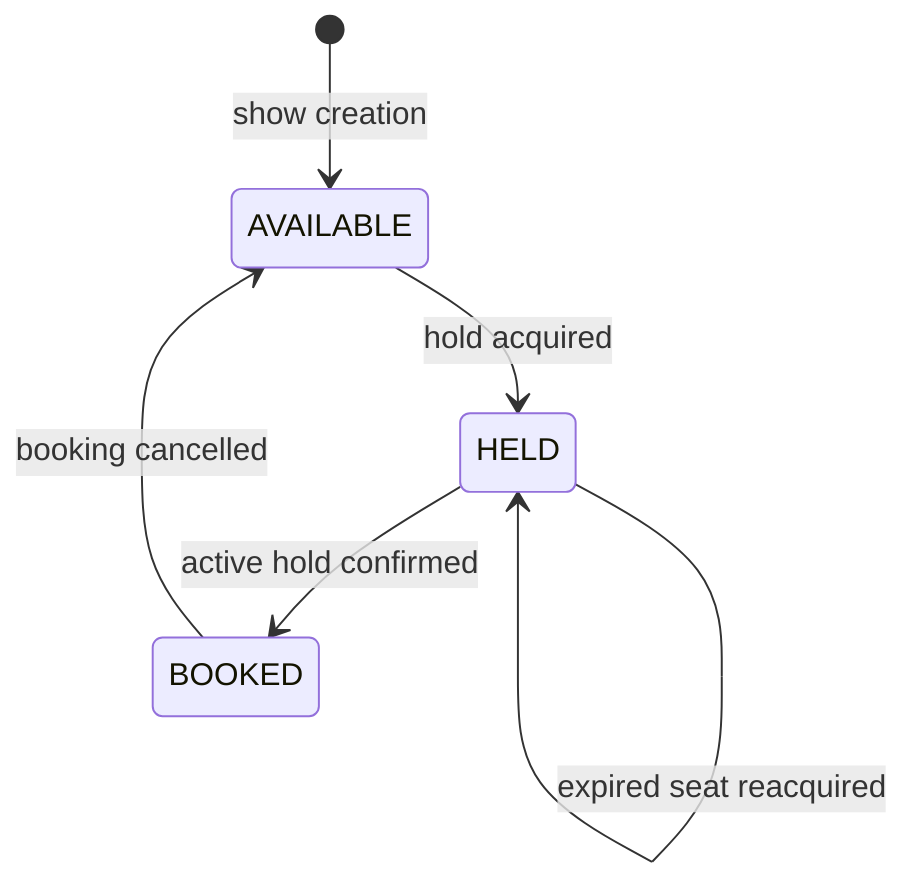

# Movie Ticketing Platform - Project HLD and LLD

**Status:** Current implemented architecture

**Last updated:** 2026-09-27

**Implementation baseline:** Flyway migrations `V1` through `V7`

## 1. Purpose

This document is the repo-level architecture overview for the implemented movie-ticketing platform. It combines:

- a high-level design (HLD) describing system boundaries, capabilities, data ownership, security, and major flows; and
- a low-level design (LLD) describing packages, important classes, database structures, API routes, transaction boundaries, locking, and extension points.

Feature documents under this folder remain the detailed source for individual decisions. This document describes how those features fit together in the current repository. The implementation and Flyway migrations are authoritative if a historical phase description conflicts with current behavior.

## 2. Goals and Current Scope

The platform is a Java 21 and Spring Boot monolith backed by PostgreSQL. It currently supports:

- customer and theatre-administrator identity with JWT authentication;
- a public, seeded city catalogue;
- owner-scoped theatre, auditorium, and physical-seat creation;
- a minimal public movie catalogue;
- owner-checked show scheduling and show-specific seat snapshots;
- public movie, show, and seat discovery;
- concurrency-safe, time-bound customer seat holds;
- retry-safe booking confirmation and customer booking history;
- concurrency-safe, whole-booking cancellation before show start; and
- best-effort booking confirmation and cancellation notifications through a local logging adapter.

The current scope deliberately excludes payments, discounts, refunds, partial cancellation, reminder notifications, external notification providers, theatre resource updates/deletion, a UI, deployment automation, and microservices.

## 3. High-Level Design

### 3.1 System context



There is one deployable Spring Boot application and one transactional PostgreSQL database. Correctness does not require a single application instance because the database is the concurrency authority for show scheduling, seat holds, booking confirmation, and cancellation. The local notification adapter writes after-commit lifecycle messages to the running instance's application logs.

### 3.2 Logical capability view



These are package boundaries inside one deployable monolith, not separately deployed services. Cross-capability work shares a single database transaction where atomicity requires it.

### 3.3 Capability responsibilities

| Capability | Responsibility | Primary persisted data |
|---|---|---|
| Identity | Signup, sign-in, JWT issue/verification, authenticated principal | `user_account` |
| City | Public read-only catalogue | `city` |
| Theatre | Owned theatres, auditoriums, reusable physical-seat layout | `theatre`, `auditorium`, `physical_seat` |
| Movie | Minimal global movie catalogue | `movie` |
| Show | Scheduling, tier prices, immutable show-seat snapshots, public discovery | `movie_show`, `show_tier_price`, `show_seat` |
| Hold | Temporary, owner-scoped seat acquisition and lazy expiry | `seat_hold`, `seat_hold_item`, `show_seat.current_hold_id` |
| Booking | Confirmation, history, cancellation, current booked-seat ownership | `booking`, `booking_item`, `show_seat.current_booking_id` |
| Notification | Map committed booking events to a pluggable sender | No notification table in this version |

### 3.4 Architectural principles

- **Monolith first:** capability packages provide separation without distributed transactions or network calls between modules.
- **Database-enforced correctness:** transactions, row locks, unique keys, foreign keys, composite foreign keys, and checks protect critical invariants.
- **Show seats are the sales boundary:** holds and bookings use `show_seat.id`; physical seats only define the reusable auditorium layout.
- **Immutable commercial snapshots:** a show seat retains its row, number, tier, price, and currency even if physical layout support is expanded later.
- **Derived values stay derived:** `seatLabel`, hold status, and effective expired-hold availability are calculated rather than redundantly stored.
- **Server-owned authorization context:** account and role come from the verified JWT, never from business request bodies.
- **UTC internally:** persisted timestamps and application instants use UTC; `Asia/Kolkata` is used only to interpret a customer's show-search date.
- **Explicit monetary values:** Java `BigDecimal` maps to PostgreSQL `NUMERIC(12,2)` and currency is stored with show pricing and booking snapshots.

## 4. Security and Access Model

### 4.1 Authentication

Customer and theatre-administrator signup are public but use separate endpoints that assign fixed roles. Sign-in is shared. Passwords are BCrypt-hashed with strength 12. The signed HS256 JWT contains the account UUID in `sub`, the account role, and the authentication method.

Spring Security runs statelessly. JWT conversion creates an `AccountPrincipal` and one authority: `ROLE_CUSTOMER` or `ROLE_THEATRE_ADMIN`.

### 4.2 Authorization matrix

| Operation group | Anonymous | `CUSTOMER` | `THEATRE_ADMIN` |
|---|---:|---:|---:|
| Signup and sign-in | Yes | Yes | Yes |
| Current account | No | Yes | Yes |
| Read cities, movies, shows, show seats | Yes | Yes | Yes |
| Create/list owned theatre data | No | No | Yes |
| Create movies and schedule owned shows | No | No | Yes |
| Create/read owned holds | No | Yes | No |
| Confirm/read/list/cancel owned bookings | No | Yes | No |

Spring Security performs route- and role-level checks. Application services additionally enforce resource ownership. Cross-owner theatre, hold, and booking access is generally reported as not found to avoid identifier disclosure.

### 4.3 Authentication extensibility

Business services depend on the application principal rather than raw JWT objects. `AccessTokenIssuer` separates token production from signup/sign-in application logic, while Spring Security's provider model isolates password authentication. A later mechanism can produce the same account principal without changing booking or theatre use cases.

## 5. Data Architecture

### 5.1 Relationship overview



`show_seat.current_hold_id` points to the hold that currently controls a stored `HELD` seat. `show_seat.current_booking_id` points to the booking that currently controls a stored `BOOKED` seat. Historical hold and booking items remain after the current pointer moves or is cleared.

### 5.2 Core database invariants

| Invariant | Enforcement |
|---|---|
| One account per normalized email | Unique `user_account.email_normalized` |
| Valid account role/status | Check constraints |
| One physical coordinate per auditorium | Unique `(auditorium_id, row_label, seat_number)` |
| One movie per simplified duplicate key | Unique case-insensitive title/language/runtime index |
| One show-seat snapshot per physical seat and show | Unique `(show_id, physical_seat_id)` |
| One show-seat coordinate per show | Unique `(show_id, row_label, seat_number)` |
| Consistent seat owner pointers for `AVAILABLE`, `HELD`, `BOOKED` | `ck_show_seat_ownership_consistency` |
| One booking per source hold | Unique `booking.source_hold_id` |
| Current booking really contains the exact show seat | Composite FK `(show_seat.current_booking_id, show_seat.id)` to `booking_item` |
| Booking cancellation timestamp matches state | Booking status/timestamp checks |
| Monetary precision | `NUMERIC(12,2)` plus positive/non-negative checks |

### 5.3 Flyway history

| Migration | Purpose |
|---|---|
| `V1` | User accounts and identity constraints |
| `V2` | City, theatre, auditorium, and physical-seat schema |
| `V3` | Seed 50 Indian cities |
| `V4` | Movie, show, tier-price, and initial show-seat schema |
| `V5` | Seat holds, hold items, and current-hold seat ownership |
| `V6` | Confirmed bookings, booking items, and current-booking seat ownership |
| `V7` | Booking cancellation state and timestamp constraints |

Migrations are append-only. Hibernate runs with `ddl-auto=validate`; it validates rather than creates or mutates the schema.

## 6. Main Runtime Flows

### 6.1 Theatre setup and show scheduling

1. A `THEATRE_ADMIN` creates an owned theatre using a seeded city ID.
2. The owner creates an auditorium and physical-seat rows.
3. An administrator creates or reuses a global movie.
4. To schedule a show, the service locks the owned auditorium row.
5. It validates future start time, non-empty layout, exact price coverage for every used tier, and no time overlap.
6. It inserts the show, tier prices, and one show-seat snapshot per physical seat in one transaction.

The auditorium row is the serialization point. Shows in different auditoriums can be scheduled concurrently. Time ranges are half-open, `[startsAt, endsAt)`, so back-to-back shows are allowed.

### 6.2 Seat hold

```mermaid
sequenceDiagram
    actor Customer
    participant API as Hold API
    participant Service as SeatHoldService
    participant DB as PostgreSQL

    Customer->>API: POST showSeatIds
    API->>Service: createHold(accountId, showId, ids)
    Service->>DB: lock requested show_seat rows ordered by UUID
    Service->>Service: capture UTC acquiredAt after locks
    Service->>DB: load referenced current holds as a set
    Service->>Service: validate all seats effectively available
    Service->>DB: insert hold and items; assign all seat pointers
    DB-->>Service: commit
    Service-->>Customer: 201 ACTIVE hold
```

The request is all-or-nothing. A stored `HELD` seat is effectively available when its referenced hold has expired. Expiry needs no cron job or cleanup write; the next successful holder replaces the current pointer while history remains intact.

### 6.3 Booking confirmation

1. Lock the customer-owned `seat_hold` row.
2. Look up an existing booking for `source_hold_id`; return it on a retry.
3. Lock every hold seat in UUID order.
4. Capture the UTC confirmation instant after locks.
5. Reject expired holds, started shows, or lost seat ownership.
6. Insert the booking.
7. Insert and flush all booking items.
8. Change every show seat to `BOOKED`, clear its hold pointer, and assign the booking pointer.
9. Publish a confirmation event inside the transaction; its listener runs only after commit.

The unique source-hold key supplies idempotency. The first success returns `201`; subsequent exact retries return the same booking with `200` and do not publish another event.

### 6.4 Booking cancellation

1. Lock the customer-owned booking row.
2. Return the existing result immediately if it is already `CANCELLED`.
3. Lock every booking show seat in UUID order.
4. Validate the complete item count and current seat ownership.
5. Capture the UTC cancellation instant and require it to be before show start.
6. Change the booking to `CANCELLED`, set `cancelled_at`, and release every seat to `AVAILABLE`.
7. Publish one cancellation event for the state-changing path only.

Booking state and every seat update commit or roll back together. A released seat is immediately eligible for another hold. The historical booking and items are retained.

### 6.5 Notification delivery

Booking services publish type-safe lifecycle events only on new state transitions. `BookingNotificationListener` uses:

```text
@TransactionalEventListener(phase = AFTER_COMMIT, fallbackExecution = false)
```

The listener maps the event to a `NotificationMessage` and calls the configured `NotificationSender`. The current sender records structured logs. Sender failures are caught after commit, so they cannot undo confirmation or cancellation. Delivery is best effort and is not durable across a process crash.

## 7. Low-Level Design

### 7.1 Package organization

Each business capability follows a lightweight layered structure:

```text
<capability>/
|- api/           controllers and HTTP request/response records
|- application/   transactional use cases, query projections, ports, exceptions
|- domain/        JPA entities, value enums, and repositories
`- config/        capability-specific configuration where required
```

| Package | Important implementation classes |
|---|---|
| `identity` | `IdentityController`, `RegistrationService`, `AuthenticationService`, `SecurityConfiguration`, `JwtAccessTokenIssuer` |
| `city` | `CityController`, `CityCatalogService`, `CityRepository` |
| `theatre` | `TheatreController`, `TheatreManagementService`, theatre/auditorium/seat entities and repositories |
| `movie` | `MovieController`, `MovieCatalogService`, `MovieRepository` |
| `show` | `ShowController`, `ShowService`, `MovieShowRepository`, `ShowSeatRepository` |
| `hold` | `SeatHoldController`, `SeatHoldService`, `HoldConversionLookup`, hold entities/repositories |
| `booking` | `BookingController`, `BookingService`, `BookingBackedHoldConversionLookup`, booking entities/repositories and lifecycle events |
| `notification` | `BookingNotificationListener`, `NotificationService`, `NotificationSender`, `LoggingNotificationSender` |
| `shared.api` | `GlobalExceptionHandler`, `ApiProblem`, `FieldViolation` |

### 7.2 Internal dependency direction

- `theatre` uses `city` to validate city IDs.
- `show` uses `movie` and `theatre` data to create schedules and inventory.
- `hold` uses `show` inventory and defines the `HoldConversionLookup` port.
- `booking` uses hold and show data and supplies the PostgreSQL-backed implementation of `HoldConversionLookup`.
- `notification` consumes booking lifecycle events but booking does not depend on a concrete notification adapter.
- API packages use the identity `AccountPrincipal` supplied by Spring Security.

The hold-owned conversion interface prevents `SeatHoldService` from importing `BookingRepository`, avoiding a hold/booking package cycle. The lookup remains synchronous and uses the same PostgreSQL database and surrounding read transaction.

### 7.3 Public API inventory

| Access | Method | Path |
|---|---|---|
| Public | `POST` | `/api/v1/auth/customers/signup` |
| Public | `POST` | `/api/v1/auth/admins/signup` |
| Public | `POST` | `/api/v1/auth/signin` |
| Authenticated | `GET` | `/api/v1/auth/me` |
| Public | `GET` | `/api/v1/cities` |
| Public | `GET` | `/api/v1/cities/{cityId}` |
| `THEATRE_ADMIN` | `POST`, `GET` | `/api/v1/theatres` |
| Owning `THEATRE_ADMIN` | `POST`, `GET` | `/api/v1/theatres/{theatreId}/auditoriums` |
| Owning `THEATRE_ADMIN` | `POST` | `/api/v1/theatres/{theatreId}/auditoriums/{auditoriumId}/seat-rows` |
| Owning `THEATRE_ADMIN` | `GET` | `/api/v1/theatres/{theatreId}/auditoriums/{auditoriumId}/seats` |
| `THEATRE_ADMIN` | `POST` | `/api/v1/movies` |
| Public | `GET` | `/api/v1/movies` |
| Public | `GET` | `/api/v1/movies/{movieId}` |
| Owning `THEATRE_ADMIN` | `POST` | `/api/v1/theatres/{theatreId}/auditoriums/{auditoriumId}/shows` |
| Public | `GET` | `/api/v1/shows?cityId=&movieId=&date=` |
| Public | `GET` | `/api/v1/shows/{showId}` |
| Public | `GET` | `/api/v1/shows/{showId}/seats` |
| `CUSTOMER` | `POST` | `/api/v1/shows/{showId}/holds` |
| Owning `CUSTOMER` | `GET` | `/api/v1/holds/{holdId}` |
| Owning `CUSTOMER` | `POST` | `/api/v1/holds/{holdId}/booking` |
| Owning `CUSTOMER` | `GET` | `/api/v1/bookings/{bookingId}` |
| `CUSTOMER` | `GET` | `/api/v1/bookings?page=&size=` |
| Owning `CUSTOMER` | `POST` | `/api/v1/bookings/{bookingId}/cancellation` |

The README contains request/response guidance, while the import-ready Postman collection under `Docs/collection/` contains executable examples and variables.

### 7.4 Seat state and ownership



An expired hold does not immediately mutate the stored seat row. Reads treat an expired `HELD` row as effectively `AVAILABLE`; reacquisition changes its current hold pointer. `BOOKED` is never effectively available until an atomic cancellation releases it.

### 7.5 Lock and transaction matrix

| Use case | Lock order / serialization key | Atomic writes |
|---|---|---|
| Physical-seat row creation | Database uniqueness resolves overlapping coordinates | All requested physical seats |
| Show scheduling | One owned `auditorium` row, then overlap check | Show, prices, all show-seat snapshots |
| Hold creation | Requested `show_seat` rows sorted by UUID | Hold, items, all requested seat pointers |
| Confirmation | Owned `seat_hold`, then its `show_seat` rows sorted by UUID | Booking, items, all booked seats |
| Cancellation | Owned `booking`, then its `show_seat` rows sorted by UUID | Booking status and all released seats |

No JVM-local lock participates in correctness. Stable multi-row ordering reduces deadlock risk, and each use case validates after acquiring the locks that protect its decision.

### 7.6 Read/query design

- Show search aggregates minimum price, maximum price, and effective available-seat count in one paged content query, plus a pagination count query when required.
- Show-seat listing joins current-hold expiry once and derives availability without one query per seat.
- Booking history groups booking items to return seat counts without one query per booking.
- Booking detail loads its item set as a bounded query and derives `seatLabel` from snapshotted row and number.
- Owner IDs are included in repository predicates for hold and booking reads rather than filtering results in memory.

### 7.7 Error contract

All documented application, security, and validation errors use `application/problem+json` with:

- `type`, `title`, `status`, `detail`, and `instance`;
- a stable application `code`; and
- optional field-level `violations` for validation errors.

Malformed bodies return `MALFORMED_REQUEST`. Missing, invalidly typed, or bean-invalid inputs return `VALIDATION_FAILED`. Security entry-point and access-denied responses use the same envelope. Domain conflicts such as `SHOW_TIME_CONFLICT`, `SEATS_UNAVAILABLE`, `HOLD_EXPIRED`, and ownership loss use stable codes documented by their feature designs.

### 7.8 Configuration

| Environment variable | Purpose | Default |
|---|---|---|
| `DB_URL` | PostgreSQL JDBC URL | `jdbc:postgresql://localhost:5432/movie_ticketing` |
| `DB_USERNAME` | Database user | `movie_ticketing` |
| `DB_PASSWORD` | Database password | `movie_ticketing` |
| `JWT_SECRET` | Base64 HS256 secret of at least 32 decoded bytes | Required |
| `BOOKING_HOLD_DURATION` | Positive ISO-8601 hold duration | Required |
| `NOTIFICATION_PROVIDER` | Active notification adapter | `logging` |

JWT issuer, audience, 15-minute token lifetime, and 30-second clock skew are currently application configuration constants.

## 8. Testing and Verification Strategy

- Unit tests cover normalization, password policy, token issue, service branches, time boundaries, notification mapping, and error translation.
- MockMvc integration tests cover API access, validation, ownership, response contracts, and full business flows.
- PostgreSQL Testcontainers tests validate Flyway migrations, row locking, constraints, transaction rollback, and concurrency races against the real database engine.
- The one-command API demo exercises role restrictions, show conflicts, hold races, booking/cancellation idempotency, seat release, lazy hold expiry, seat reacquisition, and expired confirmation rejection.

Tests intentionally skip Testcontainers suites when no Docker-compatible runtime is available; they do not substitute an in-memory database for PostgreSQL concurrency behavior.

## 9. Extension Points and Deferred Work

| Area | Current extension seam | Deferred behavior |
|---|---|---|
| Authentication | `AccessTokenIssuer`, Spring authentication provider, `AccountPrincipal` | OAuth/OIDC, SSO, MFA, refresh/revocation |
| Notifications | `NotificationSender` | Email/SMS/push, outbox, retry, reminders, delivery history |
| Pricing | Per-show tier-price input and snapshots | Discounts, dynamic pricing, promotion rules |
| Payments | Booking confirmation boundary | Authorization, callbacks, reconciliation |
| Cancellation | Whole-booking state transition | Partial cancellation, policy windows, refunds |
| Seating | Physical-seat and show-seat snapshots | Accessibility flag, map coordinates, layout editing |
| Theatre administration | Owner-scoped create/list APIs | Updates, deletion, transfer, staff delegation |

Any future flow that changes current seat ownership must use PostgreSQL transactions, preserve stable lock ordering, and update `show_seat` pointers consistently with their historical item tables.

## 10. Detailed Design References

- [Identity and authentication](identity-authentication-design.md)
- [Theatre administration](theatre-admin-management-design.md)
- [Movie catalogue and show scheduling](movie-catalogue-and-show-scheduling-design.md)
- [Customer seat holds](customer-seat-hold-design.md)
- [Booking confirmation](booking-confirmation-design.md)
- [Booking cancellation](booking-cancellation-design.md)
- [Booking lifecycle notifications](notification-flow-design.md)
