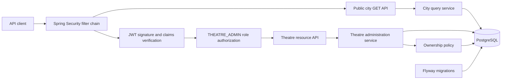
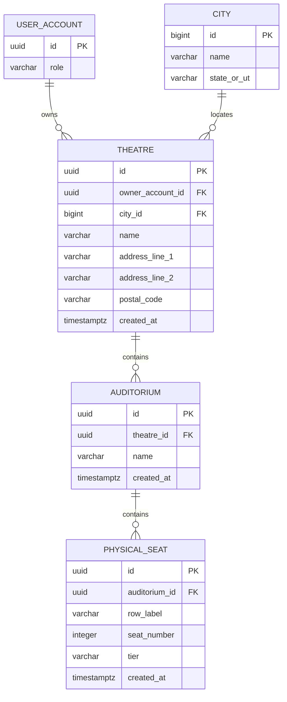
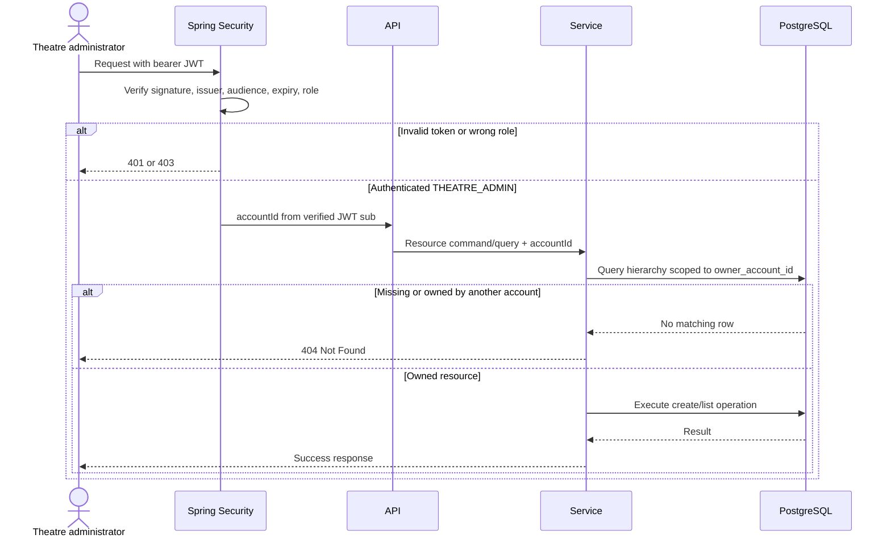
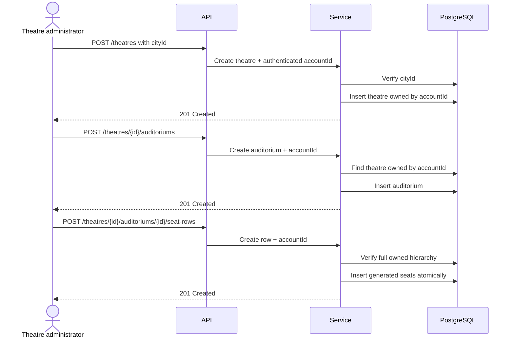

# Theatre Administration Design

**Status:** Approved and implemented

**Last updated:** 2026-09-27

**Depends on:** [Identity and Authentication Design](identity-authentication-design.md)

## 1. Purpose

This document defines the first implemented theatre-administration flow for the movie-ticketing platform. It covers the fixed city catalogue, owned theatres, auditoriums, and physical seats.

In this document, **admin** means a theatre administrator. The canonical account role is `THEATRE_ADMIN`, matching the existing `CUSTOMER` and `THEATRE_ADMIN` roles in the identity module. It does not mean a platform-wide system administrator.

## 2. Confirmed Requirements

- Seed a fixed catalogue of 50 Indian cities through Flyway.
- Persist only city data the application needs: identifier, name, and state or union territory.
- Expose the city catalogue as a public read-only API, accessible anonymously and by both account roles.
- Do not put `admin` in resource URLs.
- Protect theatre-management operations with Spring Security and JWT verification.
- Allow a theatre administrator to create a theatre using a valid `cityId`.
- Allow a theatre administrator to list only their own theatres.
- Allow a theatre administrator to create and list auditoriums within an owned theatre.
- Allow a theatre administrator to create a complete row of physical seats and list physical seats within an owned auditorium.
- Derive `seatLabel` for API responses; do not persist it.
- Keep accessibility separate from seat tier and defer accessibility modelling.
- Keep weekend and other show pricing outside the physical-seat model.
- Do not expose update, deactivation, or deletion APIs in this iteration.
- Keep the application a Java 21, Spring Boot, Maven, PostgreSQL, Flyway monolith.

## 3. Terminology

| Term | Meaning |
|---|---|
| Theatre administrator | A user account with the existing `THEATRE_ADMIN` role. |
| Theatre | A physical cinema venue at an address in one seeded city. |
| Auditorium | A screen or hall within a theatre. |
| Physical seat | A seat in an auditorium's reusable layout, identified by row label and seat number. |
| Seat tier | A layout classification such as `REGULAR` or `PREMIUM`; it is not a price. |
| Seat label | A response-only value derived from `rowLabel` and `seatNumber`, such as `A12`. |
| Owner | The `user_account` identified by the verified JWT `sub` claim and stored on the theatre. |

## 4. Scope

### 4.1 In scope

- Public read-only city list and city-detail APIs.
- Theatre creation and owner-scoped theatre listing.
- Auditorium creation and owner-scoped auditorium listing.
- Atomic creation of a row of physical seats.
- Owner-scoped physical-seat listing.
- JWT authentication, `THEATRE_ADMIN` role authorization, and ownership checks for theatre resources.
- Database constraints and transactions for create-time consistency.
- Flyway schema and seed migrations `V2` and `V3`.

### 4.2 Out of scope

- Updating, deactivating, deleting, or transferring a theatre.
- Updating, deactivating, or deleting an auditorium.
- Updating, deactivating, or deleting physical seats or seat rows.
- Platform/system administrator capabilities.
- Multiple owners, delegated theatre managers, or staff permissions.
- Adding, editing, or deleting cities through an API.
- Movies, shows, schedules, seat inventory, holds, bookings, and payments.
- Hold and booking concurrency control. Those concerns are implemented separately by the [customer seat hold](customer-seat-hold-design.md), [booking confirmation](booking-confirmation-design.md), and [booking cancellation](booking-cancellation-design.md) designs against show-specific inventory.
- Prices on physical seats, including weekday, weekend, holiday, surge, or show-specific prices.
- Accessibility attributes. A later independent flag or attribute may mark a seat accessible regardless of its tier.
- Seat-map images, coordinates, aisles, gaps, and a visual layout editor.
- Geographic coordinates, maps, service areas, and distance searches.

## 5. Key Design Decisions

### 5.1 Role naming

The authorization role is exactly `THEATRE_ADMIN`. This matches the identity module, which already defines the two account roles as `CUSTOMER` and `THEATRE_ADMIN`.

Spring Security treats the corresponding authority as `ROLE_THEATRE_ADMIN` when `hasRole("THEATRE_ADMIN")` is used. The JWT role claim remains `THEATRE_ADMIN`; clients do not submit a role in resource requests.

### 5.2 Resource-oriented URLs

URLs represent resources rather than caller roles. The base paths are `/api/v1/cities` and `/api/v1/theatres`, with no role prefix.

Removing a role name from a URL does not define its access policy. City GET endpoints are explicitly public. Spring Security verifies bearer JWTs and requires `THEATRE_ADMIN` for theatre-resource endpoints; application services then enforce ownership using the authenticated account ID.

### 5.3 Minimal city catalogue

Flyway inserts exactly 50 stable city rows. The `city` table stores only:

- `id`
- `name`
- `state_or_ut`

There are no persisted slugs, population figures, ranks, census names, source fields, or audit timestamps. Flyway is the only writer, and the application exposes no city mutation endpoint.

### 5.4 Ownership model

- `theatre.owner_account_id` comes from the verified JWT subject; it is never accepted from a request body.
- Auditoriums inherit ownership through their theatre.
- Physical seats inherit ownership through their auditorium and theatre.
- Child tables do not duplicate `owner_account_id`, preventing ownership data from drifting.
- Every theatre, auditorium, and seat operation includes the owner account ID in its persistence query or verified hierarchy lookup.
- A missing resource and another administrator's resource both produce `404 Not Found`, avoiding resource enumeration.

### 5.5 Create/list-only layout

This iteration exposes only create and list operations. The physical layout is immutable through the API once created. Update, deactivation, and deletion behavior will be designed later with rules for existing shows and bookings.

Because there are no updates in this iteration, the schema does not need optimistic-lock `version` columns or lifecycle `status` columns. Create-time races are handled through database uniqueness constraints and transactions.

### 5.6 Physical seat and tier model

A physical seat stores only its auditorium, normalized row label, seat number, and tier. `seatLabel` is derived for responses by concatenating the row label and seat number; it is never stored or indexed.

Initial tiers are:

- `REGULAR`
- `PREMIUM`

`ACCESSIBLE` is not a tier. Accessibility can coexist with any tier and will be represented later by a separate flag or attribute.

Tier does not contain a price. Weekend and other contextual pricing belong to a future show-pricing model.

### 5.7 Seat-row creation

The seat-row command accepts:

- `rowLabel`
- `firstSeatNumber`
- `seatCount`
- `tier`

The service expands this request into consecutive physical seats. For example, row `A`, first number `1`, and count `5` creates `A1` through `A5`. The entire row is inserted in one transaction: either every requested seat is created or none is.

## 6. High-Level Design

The feature remains inside the existing monolith. Spring Security handles authentication and role authorization. Application services handle owner-scoped use cases, and PostgreSQL constraints protect domain invariants.



### 6.1 Package responsibilities

The implementation separates the following package responsibilities:

| Area | Responsibility |
|---|---|
| `city` | Read-only catalogue queries and response mapping. |
| `theatre` | Owned theatre creation and listing. |
| `auditorium` | Auditorium creation and listing under an owned theatre. |
| `seat` | Atomic seat-row creation and physical-seat listing. |
| `security` | Public city GET rules plus JWT verification and `THEATRE_ADMIN` authorization for theatre routes. |
| `common` | Existing shared problem-response behavior. |

Controllers do not derive identity or ownership from request content. Application services receive the authenticated account ID through the identity module's authentication abstraction so another authentication mechanism can be introduced later without changing domain operations.

## 7. Domain and Data Model



### 7.1 `city`

| Column | Type | Rules |
|---|---|---|
| `id` | `BIGINT` | Primary key; explicit, stable seed value. |
| `name` | `VARCHAR(120)` | Required. |
| `state_or_ut` | `VARCHAR(120)` | Required. |

Recommended uniqueness: `(name, state_or_ut)`, case-insensitive.

### 7.2 `theatre`

| Column | Type | Rules |
|---|---|---|
| `id` | `UUID` | Primary key. |
| `owner_account_id` | `UUID` | Required foreign key to `user_account(id)`; set from authenticated account. |
| `city_id` | `BIGINT` | Required foreign key to `city(id)`. |
| `name` | `VARCHAR(150)` | Required. |
| `address_line_1` | `VARCHAR(200)` | Required. |
| `address_line_2` | `VARCHAR(200)` | Optional. |
| `postal_code` | `VARCHAR(6)` | Required; six decimal digits. |
| `created_at` | `TIMESTAMPTZ` | Required, UTC. |

Required uniqueness: case-insensitive theatre name within the same owner and city. Different owners may use the same public theatre name.

### 7.3 `auditorium`

| Column | Type | Rules |
|---|---|---|
| `id` | `UUID` | Primary key. |
| `theatre_id` | `UUID` | Required foreign key to `theatre(id)`. |
| `name` | `VARCHAR(100)` | Required; for example, `Screen 1` or `IMAX`. |
| `created_at` | `TIMESTAMPTZ` | Required, UTC. |

Required uniqueness: case-insensitive auditorium name within a theatre.

### 7.4 `physical_seat`

| Column | Type | Rules |
|---|---|---|
| `id` | `UUID` | Primary key. |
| `auditorium_id` | `UUID` | Required foreign key to `auditorium(id)`. |
| `row_label` | `VARCHAR(10)` | Required; normalized to uppercase. |
| `seat_number` | `INTEGER` | Required; positive. |
| `tier` | `VARCHAR(20)` | Required; `REGULAR` or `PREMIUM`. |
| `created_at` | `TIMESTAMPTZ` | Required, UTC. |

Required uniqueness: `(auditorium_id, row_label, seat_number)`.

The schema deliberately has no `seat_label`, price, weekend-price, accessibility, status, or version column.

## 8. Initial City Seed

Flyway inserts the following fixed rows. The ID is the stable API and foreign-key identifier; consumers must not give it any ranking meaning.

| ID | City | State / UT |
|---:|---|---|
| 1 | Mumbai | Maharashtra |
| 2 | Delhi | NCT of Delhi |
| 3 | Kolkata | West Bengal |
| 4 | Chennai | Tamil Nadu |
| 5 | Bengaluru | Karnataka |
| 6 | Hyderabad | Telangana |
| 7 | Ahmedabad | Gujarat |
| 8 | Pune | Maharashtra |
| 9 | Surat | Gujarat |
| 10 | Jaipur | Rajasthan |
| 11 | Kanpur | Uttar Pradesh |
| 12 | Lucknow | Uttar Pradesh |
| 13 | Nagpur | Maharashtra |
| 14 | Ghaziabad | Uttar Pradesh |
| 15 | Indore | Madhya Pradesh |
| 16 | Coimbatore | Tamil Nadu |
| 17 | Kochi | Kerala |
| 18 | Patna | Bihar |
| 19 | Kozhikode | Kerala |
| 20 | Bhopal | Madhya Pradesh |
| 21 | Thrissur | Kerala |
| 22 | Vadodara | Gujarat |
| 23 | Agra | Uttar Pradesh |
| 24 | Visakhapatnam | Andhra Pradesh |
| 25 | Malappuram | Kerala |
| 26 | Thiruvananthapuram | Kerala |
| 27 | Kannur | Kerala |
| 28 | Ludhiana | Punjab |
| 29 | Nashik | Maharashtra |
| 30 | Vijayawada | Andhra Pradesh |
| 31 | Madurai | Tamil Nadu |
| 32 | Varanasi | Uttar Pradesh |
| 33 | Meerut | Uttar Pradesh |
| 34 | Faridabad | Haryana |
| 35 | Rajkot | Gujarat |
| 36 | Jamshedpur | Jharkhand |
| 37 | Srinagar | Jammu and Kashmir |
| 38 | Jabalpur | Madhya Pradesh |
| 39 | Asansol | West Bengal |
| 40 | Vasai–Virar | Maharashtra |
| 41 | Prayagraj | Uttar Pradesh |
| 42 | Dhanbad | Jharkhand |
| 43 | Chhatrapati Sambhajinagar | Maharashtra |
| 44 | Amritsar | Punjab |
| 45 | Jodhpur | Rajasthan |
| 46 | Ranchi | Jharkhand |
| 47 | Raipur | Chhattisgarh |
| 48 | Kollam | Kerala |
| 49 | Gwalior | Madhya Pradesh |
| 50 | Durg–Bhilai | Chhattisgarh |

Any later spelling or display-name change requires a new Flyway migration and retains the same ID.

## 9. API and Security Conventions

- Resource base paths contain no role names.
- `GET /api/v1/cities` and `GET /api/v1/cities/{cityId}` use `permitAll` and require no JWT.
- All theatre-resource endpoints require a verified bearer JWT and role `THEATRE_ADMIN`.
- A `CUSTOMER` can read cities but receives `403 Forbidden` from theatre-resource endpoints.
- Missing, invalid, or expired JWTs receive `401 Unauthorized` using the existing identity error behavior.
- The verified JWT `sub` account UUID is the only source of requester identity.
- JSON property names use lower camel case.
- Timestamps use ISO 8601 UTC.
- UUIDs are opaque and do not encode ownership.
- Validation errors reuse the existing `application/problem+json` contract.

The implementation defines explicit role matchers for the resource routes and methods listed below. URL naming alone never grants authorization.

## 10. Endpoint Summary

| Method | Path | Purpose |
|---|---|---|
| `GET` | `/api/v1/cities` | List the fixed city catalogue. |
| `GET` | `/api/v1/cities/{cityId}` | Read one city. |
| `POST` | `/api/v1/theatres` | Create a theatre owned by the caller. |
| `GET` | `/api/v1/theatres` | List theatres owned by the caller. |
| `POST` | `/api/v1/theatres/{theatreId}/auditoriums` | Create an auditorium in an owned theatre. |
| `GET` | `/api/v1/theatres/{theatreId}/auditoriums` | List auditoriums in an owned theatre. |
| `POST` | `/api/v1/theatres/{theatreId}/auditoriums/{auditoriumId}/seat-rows` | Create one row of physical seats atomically. |
| `GET` | `/api/v1/theatres/{theatreId}/auditoriums/{auditoriumId}/seats` | List physical seats in an owned auditorium. |

There are no `PUT`, `PATCH`, or `DELETE` endpoints in this iteration.

## 11. City API Contracts

### 11.1 List cities

`GET /api/v1/cities`

The endpoint returns all 50 entries ordered by city name. Pagination and search are unnecessary for this small fixed catalogue.

Response — `200 OK`:

```json
{
  "items": [
    {
      "id": 7,
      "name": "Ahmedabad",
      "stateOrUt": "Gujarat"
    }
  ]
}
```

### 11.2 Read one city

`GET /api/v1/cities/{cityId}`

Response — `200 OK`:

```json
{
  "id": 7,
  "name": "Ahmedabad",
  "stateOrUt": "Gujarat"
}
```

Unknown ID: `404 CITY_NOT_FOUND`.

## 12. Theatre API Contracts

### 12.1 Create a theatre

`POST /api/v1/theatres`

Request:

```json
{
  "cityId": 7,
  "name": "Central Cinema",
  "addressLine1": "14 River Road",
  "addressLine2": "Navrangpura",
  "postalCode": "380009"
}
```

Response — `201 Created` with a `Location` header:

```json
{
  "id": "7ef3d58a-2ec9-4ca2-89ac-736ec9de8aa1",
  "city": {
    "id": 7,
    "name": "Ahmedabad",
    "stateOrUt": "Gujarat"
  },
  "name": "Central Cinema",
  "addressLine1": "14 River Road",
  "addressLine2": "Navrangpura",
  "postalCode": "380009",
  "createdAt": "2026-09-23T10:00:00Z"
}
```

The server sets `ownerAccountId` from the verified JWT principal. A client cannot provide or override it.

### 12.2 List owned theatres

`GET /api/v1/theatres?page=0&size=20`

The query always includes `owner_account_id = authenticatedAccountId`. Results are ordered by theatre name and ID for stable pagination.

Response — `200 OK`:

```json
{
  "items": [
    {
      "id": "7ef3d58a-2ec9-4ca2-89ac-736ec9de8aa1",
      "name": "Central Cinema",
      "city": {
        "id": 7,
        "name": "Ahmedabad",
        "stateOrUt": "Gujarat"
      },
      "addressLine1": "14 River Road",
      "addressLine2": "Navrangpura",
      "postalCode": "380009",
      "createdAt": "2026-09-23T10:00:00Z"
    }
  ],
  "page": 0,
  "size": 20,
  "totalElements": 1,
  "totalPages": 1
}
```

## 13. Auditorium API Contracts

### 13.1 Create an auditorium

`POST /api/v1/theatres/{theatreId}/auditoriums`

Request:

```json
{
  "name": "Screen 1"
}
```

Response — `201 Created` with a `Location` header:

```json
{
  "id": "dd31f63f-2351-453e-bc3a-dc1f4c2e890d",
  "theatreId": "7ef3d58a-2ec9-4ca2-89ac-736ec9de8aa1",
  "name": "Screen 1",
  "seatCount": 0,
  "createdAt": "2026-09-23T10:10:00Z"
}
```

The theatre must exist and belong to the authenticated administrator. Otherwise the response is `404 THEATRE_NOT_FOUND`.

### 13.2 List owned auditoriums

`GET /api/v1/theatres/{theatreId}/auditoriums`

The endpoint first scopes the theatre to the authenticated owner, then returns its auditoriums ordered by name and ID.

Response — `200 OK`:

```json
{
  "items": [
    {
      "id": "dd31f63f-2351-453e-bc3a-dc1f4c2e890d",
      "theatreId": "7ef3d58a-2ec9-4ca2-89ac-736ec9de8aa1",
      "name": "Screen 1",
      "seatCount": 120,
      "createdAt": "2026-09-23T10:10:00Z"
    }
  ]
}
```

`seatCount` is calculated from physical-seat rows and is not persisted on `auditorium`.

## 14. Physical Seat API Contracts

### 14.1 Create a seat row

`POST /api/v1/theatres/{theatreId}/auditoriums/{auditoriumId}/seat-rows`

Request:

```json
{
  "rowLabel": "A",
  "firstSeatNumber": 1,
  "seatCount": 5,
  "tier": "PREMIUM"
}
```

The service normalizes `rowLabel` to uppercase and expands the command into consecutive seat numbers `1` through `5`.

Response — `201 Created`:

```json
{
  "auditoriumId": "dd31f63f-2351-453e-bc3a-dc1f4c2e890d",
  "rowLabel": "A",
  "firstSeatNumber": 1,
  "seatCount": 5,
  "tier": "PREMIUM",
  "seats": [
    {
      "id": "59558716-0327-4ed8-b32c-9661e24b3330",
      "rowLabel": "A",
      "seatNumber": 1,
      "seatLabel": "A1",
      "tier": "PREMIUM"
    },
    {
      "id": "a24ab406-6462-4f51-a250-d6e69e108018",
      "rowLabel": "A",
      "seatNumber": 2,
      "seatLabel": "A2",
      "tier": "PREMIUM"
    }
  ]
}
```

The example shortens the `seats` array for readability; the actual response contains all five created seats. Each `seatLabel` is generated from `rowLabel` and `seatNumber` while mapping the response.

Before insertion, the service verifies that the auditorium belongs to the path theatre and that the theatre belongs to the authenticated account. The row expands and inserts in one transaction. Any invalid or conflicting seat causes the complete request to roll back.

### 14.2 List physical seats

`GET /api/v1/theatres/{theatreId}/auditoriums/{auditoriumId}/seats`

Response — `200 OK`:

```json
{
  "items": [
    {
      "id": "59558716-0327-4ed8-b32c-9661e24b3330",
      "rowLabel": "A",
      "seatNumber": 1,
      "seatLabel": "A1",
      "tier": "PREMIUM"
    },
    {
      "id": "a24ab406-6462-4f51-a250-d6e69e108018",
      "rowLabel": "A",
      "seatNumber": 2,
      "seatLabel": "A2",
      "tier": "PREMIUM"
    }
  ]
}
```

Results are ordered by normalized row label, seat number, and ID. The full owner/theatre/auditorium path is verified before the query returns seats.

## 15. Validation Rules

| Resource | Rule |
|---|---|
| City | `cityId` must be one of the 50 seeded IDs. |
| Theatre | Name is trimmed and contains 2–150 characters. |
| Theatre | Address line 1 is trimmed and contains 5–200 characters. |
| Theatre | Address line 2 contains at most 200 characters. |
| Theatre | Postal code contains exactly six decimal digits. |
| Theatre | Name is unique for one owner within a city, ignoring case. |
| Auditorium | Name is trimmed, contains 1–100 characters, and is unique within the theatre ignoring case. |
| Seat row | `rowLabel` contains 1–10 ASCII letters and is normalized to uppercase. |
| Seat row | `firstSeatNumber` is between 1 and 999. |
| Seat row | `seatCount` is between 1 and 500. |
| Seat row | `firstSeatNumber + seatCount - 1` does not exceed 999. |
| Seat row | `tier` is `REGULAR` or `PREMIUM`. |
| Physical seat | The generated `(auditoriumId, rowLabel, seatNumber)` must be unique. |

The row endpoint may be called more than once for the same row only when the generated seat-number ranges do not overlap. For example, `A1–A10` followed by `A11–A20` is valid; a request containing any existing coordinate fails atomically with `409 SEAT_CONFLICT`.

## 16. Authorization and Ownership Enforcement

Authorization has two independent layers:

1. Spring Security permits city GET endpoints and verifies the JWT plus `THEATRE_ADMIN` role on every theatre-resource endpoint.
2. The application/data-access layer scopes theatre resources to the authenticated JWT subject.

Representative owner-aware operations:

- Create theatre with `owner_account_id = authenticatedAccountId`.
- List theatres where `owner_account_id = authenticatedAccountId`.
- Find theatre by `theatreId` and `owner_account_id` before creating or listing auditoriums.
- Find auditorium by `auditoriumId`, `theatreId`, and theatre owner before creating or listing seats.

The exact repository method names are an implementation detail. The invariant is that ownership is enforced by a database predicate or a verified lookup inside the same transaction, not by trusting a request field.



### 16.1 Create hierarchy flow



## 17. Create-Time Consistency

This management design does not solve booking concurrency. It establishes clean physical-layout invariants consumed by the separate hold and booking capabilities:

- A physical seat has a stable UUID.
- A physical coordinate occurs once per auditorium.
- An entire requested row range is created atomically.
- Concurrent overlapping row requests cannot create duplicates because the database unique constraint is authoritative.
- A uniqueness failure rolls back the entire row request and returns `409 SEAT_CONFLICT`.

The implemented show-scheduling flow snapshots these stable physical seats into show-specific sellable inventory. The [customer seat hold](customer-seat-hold-design.md), [booking confirmation](booking-confirmation-design.md), and [booking cancellation](booking-cancellation-design.md) flows synchronize and transition that show inventory, not `physical_seat`.

## 18. Error Contract

The feature reuses the existing `application/problem+json` envelope.

```json
{
  "type": "urn:movie-ticketing:problem:theatre-not-found",
  "title": "Theatre not found",
  "status": 404,
  "detail": "Theatre was not found",
  "instance": "/api/v1/theatres/7ef3d58a-2ec9-4ca2-89ac-736ec9de8aa1/auditoriums",
  "code": "THEATRE_NOT_FOUND",
  "violations": []
}
```

| HTTP status | Code | When |
|---:|---|---|
| 400 | `VALIDATION_FAILED` | A request field or generated range is invalid. |
| 401 | `INVALID_TOKEN` / `TOKEN_EXPIRED` | JWT is missing, invalid, or expired, using existing identity behavior. |
| 403 | `FORBIDDEN` | Authenticated account lacks `THEATRE_ADMIN`. |
| 404 | `CITY_NOT_FOUND` | Requested city ID is not seeded. |
| 404 | `THEATRE_NOT_FOUND` | Theatre is missing or not owned by the requester. |
| 404 | `AUDITORIUM_NOT_FOUND` | Auditorium/path is missing or outside the owned theatre. |
| 409 | `THEATRE_NAME_CONFLICT` | Duplicate owner/city/theatre name. |
| 409 | `AUDITORIUM_NAME_CONFLICT` | Duplicate auditorium name within a theatre. |
| 409 | `SEAT_CONFLICT` | At least one generated physical-seat coordinate already exists. |

## 19. Flyway Migration Plan

The implementation uses separate append-only migrations:

1. Create `city`, `theatre`, `auditorium`, and `physical_seat`, including foreign keys, checks, unique constraints, and indexes.
2. Seed exactly 50 city rows with explicit stable IDs.

Migration version numbers will be chosen after inspecting the migrations present at implementation time. The seed is deterministic and does not call an external service.

Indexes and constraints:

- Unique case-insensitive `(city.name, city.state_or_ut)`.
- `theatre(owner_account_id, name, id)` for stable owned listings.
- `theatre(city_id)` for the foreign key.
- Unique case-insensitive `(theatre.owner_account_id, theatre.city_id, theatre.name)`.
- `auditorium(theatre_id, name, id)` for owned child listings.
- Unique case-insensitive `(auditorium.theatre_id, auditorium.name)`.
- `physical_seat(auditorium_id, row_label, seat_number, id)` for ordered seat listings.
- Unique `(physical_seat.auditorium_id, physical_seat.row_label, physical_seat.seat_number)`.
- Check constraints for physical-seat number and tier.

## 20. Security Considerations

- Define explicit Spring Security matchers for every resource endpoint and HTTP method in this design.
- Verify JWT signature, issuer, audience, expiry, and role using the existing identity configuration.
- Never trust account ID, owner ID, or role from request JSON, query parameters, or path parameters.
- Treat cross-owner access as a missing resource.
- Use parameterized persistence operations.
- Limit seat-row request size before allocating or expanding the range.
- Do not expose internal owner IDs in resource responses.
- Do not log JWTs or authorization headers.
- Keep database constraints active even when application validation exists.

## 21. Test Strategy

### 21.1 Migration and city catalogue

- A clean PostgreSQL database migrates successfully.
- Exactly 50 city rows exist.
- IDs are unique and stable; `(name, state_or_ut)` is unique.
- The city table contains only `id`, `name`, and `state_or_ut`.
- City GET endpoints return the documented minimal fields.
- No city mutation route exists.

### 21.2 JWT and role authorization

- An anonymous caller can list and read cities.
- A signed-in `CUSTOMER` can list and read cities.
- An unauthenticated theatre-resource request receives `401`.
- An invalid or expired JWT on a protected route receives the existing identity error.
- A `CUSTOMER` receives `403` on theatre-resource endpoints.
- A `THEATRE_ADMIN` can use theatre-resource endpoints subject to ownership checks.
- Resource endpoints remain protected without `/admin` in their paths.

### 21.3 Ownership isolation

- Creating a theatre always uses the JWT subject as owner.
- An owner field in request JSON is rejected or ignored by schema because it is not part of the contract.
- Administrator A's theatre list never contains Administrator B's theatres.
- Administrator A cannot create or list auditoriums under B's theatre.
- Administrator A cannot create seat rows or list seats under B's hierarchy.
- A mismatched theatre and auditorium path returns `404` and exposes no data.

### 21.4 Creation and constraints

- Theatre creation rejects an unknown city ID.
- Duplicate theatre and auditorium names produce the documented conflicts.
- A row request generates the correct inclusive seat-number range.
- Row labels are normalized before persistence and uniqueness checks.
- `seatLabel` appears in responses but no such database column exists.
- `REGULAR` and `PREMIUM` are accepted; `ACCESSIBLE` is rejected as a tier.
- Invalid and overflowing ranges are rejected before insertion.
- An overlapping row request returns `409` and inserts no seats.
- Concurrent overlapping row requests result in one success at most; no duplicate coordinates are stored.
- Non-overlapping row ranges for the same row may both succeed.

### 21.5 Integration tests

- Use PostgreSQL through Testcontainers so Flyway SQL, case-insensitive uniqueness, transactions, and ownership joins run against the actual database engine.
- Cover the complete flow: admin signup/signin, city list, theatre creation/listing, auditorium creation/listing, seat-row creation, and physical-seat listing.
- Include a concurrent integration test for overlapping seat-row creation.

## 22. Acceptance Criteria

The implementation satisfies these criteria:

- Flyway creates the minimal schema and seeds the approved 50-city catalogue.
- All documented paths omit `/admin`; Spring Security permits city GETs and requires `THEATRE_ADMIN` for theatre resources.
- City access is public and read-only and returns only relevant fields.
- Theatre creation accepts only a seeded `cityId` and takes its owner from the verified JWT.
- Theatre listing returns only the caller's theatres.
- Auditorium creation and listing require ownership of the path theatre.
- Seat-row creation generates and atomically persists the requested physical seats.
- Physical-seat listing requires ownership and derives `seatLabel` in the response.
- No update, deactivate, or delete endpoint is exposed.
- Physical seats store tier but no accessibility or pricing attributes.
- Constraints and automated tests enforce create-time consistency and ownership isolation.
- README and API documentation are updated only after this design is approved and implemented.

## 23. Confirmed Implementation Details

1. Limit one seat-row request to 500 seats and seat numbers to 1–999.
2. Permit multiple non-overlapping requests for the same row label.
3. Return all generated seats from the row-creation response rather than only a summary.
4. Return `404` for another administrator's resources to avoid identifier disclosure.
5. Use `/theatres` spelling consistently in API paths.
